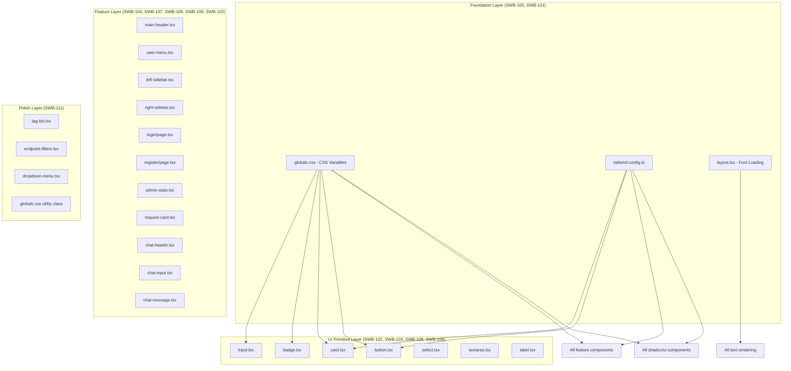

# Low-Level Design: SWB-100 through SWB-111 -- NICE.com Design System Restyling

## 1. Overview

### 1.1 Purpose

This document provides the exact, file-level implementation specification for restyling the Switchboard application to match NICE.com's design system. It covers 12 user stories (SWB-100 through SWB-111) that collectively transform the application's visual identity from the default shadcn/ui slate palette to NICE.com's dark-primary, cyan-accent, gradient-blue brand system.

### 1.2 Scope

**In Scope:**
- CSS variable updates (colors, radii, shadows)
- Tailwind configuration changes (brand colors, shadows, font family)
- Font family replacement (Inter to Be Vietnam Pro)
- Component-level class string updates (button, card, badge, input, select, textarea, label, dropdown-menu)
- Feature component styling updates (endpoint-card, status-badge, tag-badge, tag-list, endpoint-filters, main-header, left-sidebar, right-sidebar, user-menu, login page, register page, admin-stats, request-card, chat-header, chat-input, chat-message)
- Transition and hover effect standardization

**Out of Scope:**
- Layout changes (widths, heights, grid structures)
- Functional/behavioral changes (no JS/TS logic modifications)
- New component creation
- Dark mode toggle functionality changes
- API or database changes

### 1.3 References

- User Stories: `/home/mschodin/projects/switchboard_v1/docs/user-stories/SWB-RESTYLE-NICE-STORIES.md`
- Original LLD: `/home/mschodin/projects/switchboard_v1/docs/design/SWITCHBOARD-LLD.md`
- NICE.com Design System (extracted tokens in user stories document)

---

## 2. Architecture

### 2.1 Change Impact Diagram



### 2.2 Dependency Order

```
Phase 1: SWB-100 (foundation CSS vars + Tailwind config)
Phase 2: SWB-101 (typography), SWB-102 (buttons), SWB-103 (cards), SWB-105 (inputs), SWB-106 (badges)
         -- All Phase 2 stories can be implemented in parallel after Phase 1
Phase 3: SWB-104 (header), SWB-107 (sidebars), SWB-108 (auth pages), SWB-109 (admin), SWB-110 (chat), SWB-111 (transitions)
         -- Phase 3 stories can mostly run in parallel after their Phase 2 dependencies
```

---

## 3. Story-by-Story Implementation Specification

---

### 3.1 SWB-100: Update Design Tokens and CSS Variables

**Files Modified:** 2
- `/home/mschodin/projects/switchboard_v1/src/app/globals.css`
- `/home/mschodin/projects/switchboard_v1/tailwind.config.ts`

#### 3.1.1 globals.css -- Full Replacement

**Current `:root` block (lines 6-27):**
```css
:root {
    --background: 0 0% 100%;
    --foreground: 222.2 84% 4.9%;
    --card: 0 0% 100%;
    --card-foreground: 222.2 84% 4.9%;
    --popover: 0 0% 100%;
    --popover-foreground: 222.2 84% 4.9%;
    --primary: 221.2 83.2% 53.3%;
    --primary-foreground: 210 40% 98%;
    --secondary: 210 40% 96.1%;
    --secondary-foreground: 222.2 47.4% 11.2%;
    --muted: 210 40% 96.1%;
    --muted-foreground: 215.4 16.3% 46.9%;
    --accent: 210 40% 96.1%;
    --accent-foreground: 222.2 47.4% 11.2%;
    --destructive: 0 84.2% 60.2%;
    --destructive-foreground: 210 40% 98%;
    --border: 214.3 31.8% 91.4%;
    --input: 214.3 31.8% 91.4%;
    --ring: 221.2 83.2% 53.3%;
    --radius: 0.5rem;
  }
```

**New `:root` block:**
```css
:root {
    --background: 0 0% 100%;
    --foreground: 252 14% 15%;
    --card: 0 0% 100%;
    --card-foreground: 252 14% 15%;
    --popover: 0 0% 100%;
    --popover-foreground: 252 14% 15%;
    --primary: 252 14% 15%;
    --primary-foreground: 0 0% 100%;
    --secondary: 240 5% 96%;
    --secondary-foreground: 252 14% 15%;
    --muted: 240 5% 96%;
    --muted-foreground: 240 3% 44%;
    --accent: 214 60% 95%;
    --accent-foreground: 252 14% 15%;
    --destructive: 0 84.2% 60.2%;
    --destructive-foreground: 0 0% 100%;
    --border: 0 0% 0% / 0.1;
    --input: 0 0% 0% / 0.1;
    --ring: 195 100% 57%;
    --radius: 0.75rem;
    --nice-gradient: linear-gradient(135deg, #2F33F5, #5192F4, #93C3FA);
  }
```

**HSL derivation notes (for reviewer verification):**
| Token | Hex Source | HSL Value | Notes |
|-------|-----------|-----------|-------|
| `--foreground` | `#22212B` | `252 14% 15%` | NICE primary dark |
| `--primary` | `#22212B` | `252 14% 15%` | NICE primary dark |
| `--primary-foreground` | `#FFFFFF` | `0 0% 100%` | White text on dark bg |
| `--secondary` | `#F5F5F7` | `240 5% 96%` | NICE muted background |
| `--muted` | `#F5F5F7` | `240 5% 96%` | Same as secondary |
| `--muted-foreground` | `#6B6B76` | `240 3% 44%` | NICE secondary text |
| `--accent` | Light blue tint | `214 60% 95%` | Blue-tinted neutral |
| `--ring` | `#23C9FF` | `195 100% 57%` | NICE cyan accent |
| `--border` | `rgba(0,0,0,0.1)` | `0 0% 0% / 0.1` | Subtle border using alpha |
| `--input` | `rgba(0,0,0,0.1)` | `0 0% 0% / 0.1` | Matches border |

**IMPORTANT -- border/input alpha syntax:** The `--border` and `--input` values use the HSL alpha syntax `0 0% 0% / 0.1`. The Tailwind config references these as `hsl(var(--border))` which resolves to `hsl(0 0% 0% / 0.1)`. This is valid modern CSS. If browser compatibility issues arise, an alternative is `0 0% 90%` (a solid light gray approximation), but the alpha approach is preferred because it matches NICE.com's actual border treatment (`rgba(0,0,0,0.1)`).

**Current `.dark` block (lines 29-49):**
```css
.dark {
    --background: 222.2 84% 4.9%;
    --foreground: 210 40% 98%;
    --card: 222.2 84% 4.9%;
    --card-foreground: 210 40% 98%;
    --popover: 222.2 84% 4.9%;
    --popover-foreground: 210 40% 98%;
    --primary: 217.2 91.2% 59.8%;
    --primary-foreground: 222.2 47.4% 11.2%;
    --secondary: 217.2 32.6% 17.5%;
    --secondary-foreground: 210 40% 98%;
    --muted: 217.2 32.6% 17.5%;
    --muted-foreground: 215 20.2% 65.1%;
    --accent: 217.2 32.6% 17.5%;
    --accent-foreground: 210 40% 98%;
    --destructive: 0 62.8% 30.6%;
    --destructive-foreground: 210 40% 98%;
    --border: 217.2 32.6% 17.5%;
    --input: 217.2 32.6% 17.5%;
    --ring: 224.3 76.3% 48%;
  }
```

**New `.dark` block:**
```css
.dark {
    --background: 252 14% 10%;
    --foreground: 0 0% 95%;
    --card: 252 12% 14%;
    --card-foreground: 0 0% 95%;
    --popover: 252 12% 14%;
    --popover-foreground: 0 0% 95%;
    --primary: 0 0% 95%;
    --primary-foreground: 252 14% 15%;
    --secondary: 252 10% 20%;
    --secondary-foreground: 0 0% 90%;
    --muted: 252 10% 20%;
    --muted-foreground: 240 3% 60%;
    --accent: 252 10% 20%;
    --accent-foreground: 0 0% 95%;
    --destructive: 0 62.8% 30.6%;
    --destructive-foreground: 0 0% 95%;
    --border: 0 0% 100% / 0.1;
    --input: 0 0% 100% / 0.1;
    --ring: 195 100% 57%;
  }
```

**Dark mode rationale:** The dark theme inverts the relationship -- `--primary` becomes light (white text acts as primary), `--primary-foreground` becomes the dark color. The cyan ring accent (`--ring`) is preserved identically. The background uses a darker shade of the NICE primary hue (`252`).

#### 3.1.2 tailwind.config.ts -- Changes

**Change 1: Update `brand` color scale (lines 53-58)**

Current:
```ts
brand: {
  50: '#eef2ff',
  100: '#e0e7ff',
  500: '#6366f1',
  600: '#4f46e5',
  700: '#4338ca',
},
```

New:
```ts
brand: {
  50: '#eef2ff',
  100: '#dbeafe',
  200: '#bfdbfe',
  500: '#5192F4',
  600: '#2F33F5',
  700: '#1e1fb3',
},
```

**Change 2: Add `boxShadow` to `extend` section (after `borderRadius` block, line 74)**

Add the following new property inside `extend`:
```ts
boxShadow: {
  subtle: '0 1px 3px rgba(0, 0, 0, 0.06)',
  card: '0 2px 8px rgba(0, 0, 0, 0.08)',
  elevated: '0 8px 24px rgba(0, 0, 0, 0.12)',
},
```

**Change 3: Update `fontFamily.sans` (line 76)**

Current:
```ts
sans: ['var(--font-geist-sans)', 'system-ui', 'sans-serif'],
```

New (will be fully addressed in SWB-101, but the variable name changes here):
```ts
sans: ['var(--font-beVietnam)', 'system-ui', 'sans-serif'],
```

**Full updated `tailwind.config.ts`:**
```ts
import type { Config } from 'tailwindcss'

const config: Config = {
  darkMode: ['class'],
  content: [
    './src/pages/**/*.{js,ts,jsx,tsx,mdx}',
    './src/components/**/*.{js,ts,jsx,tsx,mdx}',
    './src/app/**/*.{js,ts,jsx,tsx,mdx}',
  ],
  theme: {
    container: {
      center: true,
      padding: '2rem',
      screens: {
        '2xl': '1400px',
      },
    },
    extend: {
      colors: {
        border: 'hsl(var(--border))',
        input: 'hsl(var(--input))',
        ring: 'hsl(var(--ring))',
        background: 'hsl(var(--background))',
        foreground: 'hsl(var(--foreground))',
        primary: {
          DEFAULT: 'hsl(var(--primary))',
          foreground: 'hsl(var(--primary-foreground))',
        },
        secondary: {
          DEFAULT: 'hsl(var(--secondary))',
          foreground: 'hsl(var(--secondary-foreground))',
        },
        destructive: {
          DEFAULT: 'hsl(var(--destructive))',
          foreground: 'hsl(var(--destructive-foreground))',
        },
        muted: {
          DEFAULT: 'hsl(var(--muted))',
          foreground: 'hsl(var(--muted-foreground))',
        },
        accent: {
          DEFAULT: 'hsl(var(--accent))',
          foreground: 'hsl(var(--accent-foreground))',
        },
        popover: {
          DEFAULT: 'hsl(var(--popover))',
          foreground: 'hsl(var(--popover-foreground))',
        },
        card: {
          DEFAULT: 'hsl(var(--card))',
          foreground: 'hsl(var(--card-foreground))',
        },
        brand: {
          50: '#eef2ff',
          100: '#dbeafe',
          200: '#bfdbfe',
          500: '#5192F4',
          600: '#2F33F5',
          700: '#1e1fb3',
        },
        status: {
          active: '#22c55e',
          inactive: '#eab308',
          deprecated: '#ef4444',
        },
      },
      spacing: {
        'sidebar-left': '280px',
        'sidebar-right': '360px',
      },
      borderRadius: {
        lg: 'var(--radius)',
        md: 'calc(var(--radius) - 2px)',
        sm: 'calc(var(--radius) - 4px)',
      },
      boxShadow: {
        subtle: '0 1px 3px rgba(0, 0, 0, 0.06)',
        card: '0 2px 8px rgba(0, 0, 0, 0.08)',
        elevated: '0 8px 24px rgba(0, 0, 0, 0.12)',
      },
      fontFamily: {
        sans: ['var(--font-beVietnam)', 'system-ui', 'sans-serif'],
        mono: ['var(--font-geist-mono)', 'monospace'],
      },
      keyframes: {
        'accordion-down': {
          from: { height: '0' },
          to: { height: 'var(--radix-accordion-content-height)' },
        },
        'accordion-up': {
          from: { height: 'var(--radix-accordion-content-height)' },
          to: { height: '0' },
        },
      },
      animation: {
        'accordion-down': 'accordion-down 0.2s ease-out',
        'accordion-up': 'accordion-up 0.2s ease-out',
      },
    },
  },
  plugins: [require('tailwindcss-animate')],
}

export default config
```

**Verification Checklist for SWB-100:**
- [ ] `--primary` resolves to `#22212B` (dark near-black)
- [ ] `--primary-foreground` resolves to white
- [ ] `--radius` is `0.75rem`
- [ ] `--ring` resolves to `#23C9FF` (cyan)
- [ ] `--border` produces `rgba(0,0,0,0.1)` equivalent
- [ ] `--nice-gradient` custom property is defined
- [ ] `shadow-subtle`, `shadow-card`, `shadow-elevated` utilities work
- [ ] `brand-500` resolves to `#5192F4`, `brand-600` to `#2F33F5`
- [ ] Status colors (`active`, `inactive`, `deprecated`) are unchanged
- [ ] Contrast ratio: `#22212B` on `#FFFFFF` >= 13:1 (passes AAA)

---

### 3.2 SWB-101: Update Typography to Be Vietnam Pro

**Files Modified:** 2
- `/home/mschodin/projects/switchboard_v1/src/app/layout.tsx`
- `/home/mschodin/projects/switchboard_v1/tailwind.config.ts` (font variable change already captured in SWB-100)

#### 3.2.1 layout.tsx -- Full Replacement

**Current (lines 1-29):**
```tsx
import type { Metadata } from 'next'
import { Inter } from 'next/font/google'
import './globals.css'
import { AuthProvider } from '@/components/auth/auth-provider'
import { Toaster } from '@/components/ui/toaster'

const inter = Inter({ subsets: ['latin'] })

export const metadata: Metadata = {
  title: 'Switchboard - API Endpoint Registry',
  description: 'Browse and discover API endpoints',
}

export default function RootLayout({
  children,
}: {
  children: React.ReactNode
}) {
  return (
    <html lang="en">
      <body className={inter.className}>
        <AuthProvider>
          {children}
          <Toaster />
        </AuthProvider>
      </body>
    </html>
  )
}
```

**New:**
```tsx
import type { Metadata } from 'next'
import { Be_Vietnam_Pro } from 'next/font/google'
import './globals.css'
import { AuthProvider } from '@/components/auth/auth-provider'
import { Toaster } from '@/components/ui/toaster'

const beVietnamPro = Be_Vietnam_Pro({
  subsets: ['latin'],
  weight: ['200', '300', '400', '500', '600', '900'],
  variable: '--font-beVietnam',
  display: 'swap',
})

export const metadata: Metadata = {
  title: 'Switchboard - API Endpoint Registry',
  description: 'Browse and discover API endpoints',
}

export default function RootLayout({
  children,
}: {
  children: React.ReactNode
}) {
  return (
    <html lang="en">
      <body className={`${beVietnamPro.variable} font-sans`}>
        <AuthProvider>
          {children}
          <Toaster />
        </AuthProvider>
      </body>
    </html>
  )
}
```

**Key Changes:**
1. Import changed from `Inter` to `Be_Vietnam_Pro`
2. Configuration includes 6 weights: `200`, `300`, `400`, `500`, `600`, `900`
3. `variable: '--font-beVietnam'` creates the CSS custom property referenced in `tailwind.config.ts`
4. `display: 'swap'` is explicitly set (next/font defaults to this, but being explicit is clearer)
5. Body class changed from `{inter.className}` to `{beVietnamPro.variable} font-sans` -- the `variable` approach applies the CSS variable to the element, and `font-sans` triggers Tailwind's `font-family: var(--font-beVietnam), system-ui, sans-serif` from the config
6. `subsets: ['latin']` keeps bundle under 150KB target

**Why `variable` instead of `className`:** Using the `variable` approach + Tailwind's `font-sans` ensures that ALL components that use Tailwind's default font-family (which is `font-sans`) get the font. The `className` approach only sets the font on the element directly, requiring all children to inherit -- which can break if any component overrides `font-family`.

**Verification Checklist for SWB-101:**
- [ ] `document.body` computed font-family starts with `Be Vietnam Pro`
- [ ] Font weights 200, 300, 400, 500, 600, 900 are available
- [ ] No FOUT (Flash of Unstyled Text) visible on page load
- [ ] Tailwind `font-sans` resolves to `Be Vietnam Pro, system-ui, sans-serif`
- [ ] Total font file download < 150KB (check Network tab)

---

### 3.3 SWB-102: Restyle Button Component Variants

**File Modified:** 1
- `/home/mschodin/projects/switchboard_v1/src/components/ui/button.tsx`

#### 3.3.1 button.tsx -- CVA String Updates

**Current base CVA string (line 8):**
```
"inline-flex items-center justify-center gap-2 whitespace-nowrap rounded-md text-sm font-medium ring-offset-background transition-colors focus-visible:outline-none focus-visible:ring-2 focus-visible:ring-ring focus-visible:ring-offset-2 disabled:pointer-events-none disabled:opacity-50 [&_svg]:pointer-events-none [&_svg]:size-4 [&_svg]:shrink-0"
```

**New base CVA string:**
```
"inline-flex items-center justify-center gap-2 whitespace-nowrap rounded-md text-sm font-medium ring-offset-background transition-all duration-200 ease-in-out focus-visible:outline-none focus-visible:ring-2 focus-visible:ring-ring focus-visible:ring-offset-2 disabled:pointer-events-none disabled:opacity-50 [&_svg]:pointer-events-none [&_svg]:size-4 [&_svg]:shrink-0"
```

**Diff:** `transition-colors` changed to `transition-all duration-200 ease-in-out`

**Current variant definitions (lines 11-20):**
```ts
default: "bg-primary text-primary-foreground hover:bg-primary/90",
destructive:
  "bg-destructive text-destructive-foreground hover:bg-destructive/90",
outline:
  "border border-input bg-background hover:bg-accent hover:text-accent-foreground",
secondary:
  "bg-secondary text-secondary-foreground hover:bg-secondary/80",
ghost: "hover:bg-accent hover:text-accent-foreground",
link: "text-primary underline-offset-4 hover:underline",
```

**New variant definitions:**
```ts
default: "bg-primary text-primary-foreground hover:bg-primary/85",
destructive:
  "bg-destructive text-destructive-foreground hover:bg-destructive/90",
outline:
  "border border-foreground/20 bg-background text-foreground hover:bg-foreground/5",
secondary:
  "bg-secondary text-secondary-foreground hover:bg-secondary/70",
ghost: "hover:bg-accent/80 hover:text-accent-foreground",
link: "text-[#23C9FF] underline-offset-4 hover:underline",
```

**Changes summarized:**
| Variant | Property | Old | New | Reason |
|---------|----------|-----|-----|--------|
| `default` | hover | `hover:bg-primary/90` | `hover:bg-primary/85` | Slightly more visible opacity shift on dark bg |
| `outline` | border | `border-input` | `border-foreground/20` | Visible dark border instead of light gray |
| `outline` | hover | `hover:bg-accent hover:text-accent-foreground` | `hover:bg-foreground/5` | Subtle fill on hover |
| `outline` | text | (inherited) | `text-foreground` | Explicit dark text |
| `secondary` | hover | `hover:bg-secondary/80` | `hover:bg-secondary/70` | Slightly stronger hover |
| `ghost` | hover bg | `hover:bg-accent` | `hover:bg-accent/80` | Slightly more visible |
| `link` | text | `text-primary` | `text-[#23C9FF]` | Cyan accent for links |

**Current size definitions (lines 22-26):**
```ts
default: "h-10 px-4 py-2",
sm: "h-9 rounded-md px-3",
lg: "h-11 rounded-md px-8",
icon: "h-10 w-10",
```

**New size definitions:**
```ts
default: "h-10 px-4 py-2",
sm: "h-9 rounded-md px-3",
lg: "h-11 rounded-md px-6",
icon: "h-10 w-10",
```

**Change:** `lg` padding changed from `px-8` to `px-6` (slightly less generous, matching NICE's button proportions).

**Full updated `buttonVariants` definition:**
```ts
const buttonVariants = cva(
  "inline-flex items-center justify-center gap-2 whitespace-nowrap rounded-md text-sm font-medium ring-offset-background transition-all duration-200 ease-in-out focus-visible:outline-none focus-visible:ring-2 focus-visible:ring-ring focus-visible:ring-offset-2 disabled:pointer-events-none disabled:opacity-50 [&_svg]:pointer-events-none [&_svg]:size-4 [&_svg]:shrink-0",
  {
    variants: {
      variant: {
        default: "bg-primary text-primary-foreground hover:bg-primary/85",
        destructive:
          "bg-destructive text-destructive-foreground hover:bg-destructive/90",
        outline:
          "border border-foreground/20 bg-background text-foreground hover:bg-foreground/5",
        secondary:
          "bg-secondary text-secondary-foreground hover:bg-secondary/70",
        ghost: "hover:bg-accent/80 hover:text-accent-foreground",
        link: "text-[#23C9FF] underline-offset-4 hover:underline",
      },
      size: {
        default: "h-10 px-4 py-2",
        sm: "h-9 rounded-md px-3",
        lg: "h-11 rounded-md px-6",
        icon: "h-10 w-10",
      },
    },
    defaultVariants: {
      variant: "default",
      size: "default",
    },
  }
)
```

**Verification Checklist for SWB-102:**
- [ ] Default button: dark bg (`#22212B`), white text, 8px radius
- [ ] Default button hover: transitions to `primary/85` over 200ms
- [ ] Outline button: transparent bg, visible dark border, dark text
- [ ] Outline button hover: subtle `foreground/5` fill
- [ ] Secondary button: light gray bg, dark text, hover at `/70`
- [ ] Ghost button hover: visible accent fill at `/80`
- [ ] Link variant: cyan `#23C9FF` text
- [ ] `lg` size: `px-6` padding, `h-11` height
- [ ] Focus ring uses cyan color (from `--ring` CSS variable)
- [ ] All transitions are 200ms ease-in-out

---

### 3.4 SWB-103: Restyle Card and Container Components

**Files Modified:** 2
- `/home/mschodin/projects/switchboard_v1/src/components/ui/card.tsx`
- `/home/mschodin/projects/switchboard_v1/src/components/endpoints/endpoint-card.tsx`

#### 3.4.1 card.tsx -- Card Base Class Update

**Current Card class string (line 12):**
```
"rounded-lg border bg-card text-card-foreground shadow-sm"
```

**New Card class string:**
```
"rounded-xl border border-black/[0.06] bg-card text-card-foreground shadow-card transition-all duration-200 ease-in-out"
```

**Changes:**
| Property | Old | New | Reason |
|----------|-----|-----|--------|
| border-radius | `rounded-lg` | `rounded-xl` | 12px radius per NICE |
| border | `border` | `border border-black/[0.06]` | Nearly invisible border |
| shadow | `shadow-sm` | `shadow-card` | NICE's card shadow: `0 2px 8px rgba(0,0,0,0.08)` |
| transition | (none) | `transition-all duration-200 ease-in-out` | Smooth hover transitions |

**No changes to CardHeader, CardTitle, CardDescription, CardContent, or CardFooter.** Their existing classes are already appropriate:
- `CardHeader`: `flex flex-col space-y-1.5 p-6` -- correct
- `CardTitle`: `text-2xl font-semibold leading-none tracking-tight` -- correct (font-weight 600 = semibold)
- `CardDescription`: `text-sm text-muted-foreground` -- correct
- `CardContent`: `p-6 pt-0` -- correct
- `CardFooter`: `flex items-center p-6 pt-0` -- correct

#### 3.4.2 endpoint-card.tsx -- Hover Class Update

**Current Card class (line 27):**
```
"cursor-pointer transition-all duration-200 hover:shadow-lg hover:shadow-brand-500/10"
```

**New Card class:**
```
"cursor-pointer hover:shadow-elevated hover:-translate-y-0.5"
```

**Changes:**
- Removed `transition-all duration-200` -- now inherited from the base `Card` component (SWB-103 card.tsx changes)
- Replaced `hover:shadow-lg hover:shadow-brand-500/10` with `hover:shadow-elevated hover:-translate-y-0.5`
- `shadow-elevated` = `0 8px 24px rgba(0,0,0,0.12)` (defined in SWB-100)
- `-translate-y-0.5` = 2px upward lift on hover

**Verification Checklist for SWB-103:**
- [ ] Card base has 12px radius (`rounded-xl`)
- [ ] Card border is nearly invisible (`border-black/[0.06]`)
- [ ] Card shadow is `0 2px 8px rgba(0,0,0,0.08)`
- [ ] Card has `transition-all duration-200 ease-in-out` built in
- [ ] EndpointCard hover: shadow elevates to `shadow-elevated`, card lifts 2px
- [ ] No duplicate transition classes on EndpointCard
- [ ] CardTitle retains `font-semibold` (weight 600)
- [ ] Card bg is white (`bg-card` resolving to `#FFFFFF`)

---

### 3.5 SWB-104: Restyle Header and Navigation

**Files Modified:** 2
- `/home/mschodin/projects/switchboard_v1/src/components/layout/main-header.tsx`
- `/home/mschodin/projects/switchboard_v1/src/components/auth/user-menu.tsx`

#### 3.5.1 main-header.tsx -- Header Background Update

**Current header class (line 24):**
```
"border-b bg-background/95 backdrop-blur supports-[backdrop-filter]:bg-background/60"
```

**New header class:**
```
"border-b border-black/[0.08] bg-white"
```

**Changes:**
- Removed `bg-background/95 backdrop-blur supports-[backdrop-filter]:bg-background/60` (glassmorphism)
- Added `bg-white` (solid white background)
- Changed border from generic `border-b` (using `--border` color) to `border-b border-black/[0.08]` (explicit subtle border matching NICE)

**No other changes in main-header.tsx.** The title styling (`text-2xl font-semibold`) and subtitle styling (`text-sm text-muted-foreground`) are already correct per AC2 and AC3. The `--muted-foreground` CSS variable now maps to `#6B6B76` (from SWB-100).

#### 3.5.2 user-menu.tsx -- Avatar Color Update

**Current AvatarFallback class (line 44):**
```
"bg-brand-500 text-white text-sm"
```

**New AvatarFallback class:**
```
"bg-primary text-primary-foreground text-sm"
```

**Change:** `bg-brand-500` (was `#6366f1` indigo) changed to `bg-primary` (now `#22212B` dark). `text-white` changed to `text-primary-foreground` (resolves to white) for semantic consistency.

**No other changes in user-menu.tsx.** The button variants (`ghost` for "Log In", `default` for "Sign Up") are already correct per AC6, and they inherit the updated styling from SWB-102.

**Verification Checklist for SWB-104:**
- [ ] Header bg is solid white (no blur/transparency)
- [ ] Header bottom border is subtle `border-black/[0.08]`
- [ ] Title "Endpoint Registry" is `text-2xl font-semibold` with dark text
- [ ] Subtitle uses muted gray (`#6B6B76` via `--muted-foreground`)
- [ ] Avatar fallback bg is dark `#22212B` (via `bg-primary`)
- [ ] Header height remains `h-16`
- [ ] Unauthenticated: "Log In" = ghost, "Sign Up" = default (dark bg)

---

### 3.6 SWB-105: Restyle Form Inputs, Selects, and Textarea

**Files Modified:** 4
- `/home/mschodin/projects/switchboard_v1/src/components/ui/input.tsx`
- `/home/mschodin/projects/switchboard_v1/src/components/ui/select.tsx`
- `/home/mschodin/projects/switchboard_v1/src/components/ui/textarea.tsx`
- `/home/mschodin/projects/switchboard_v1/src/components/ui/label.tsx`

#### 3.6.1 input.tsx -- Padding and Transition Update

**Current class string (line 11):**
```
"flex h-10 w-full rounded-md border border-input bg-background px-3 py-2 text-base ring-offset-background file:border-0 file:bg-transparent file:text-sm file:font-medium file:text-foreground placeholder:text-muted-foreground focus-visible:outline-none focus-visible:ring-2 focus-visible:ring-ring focus-visible:ring-offset-2 disabled:cursor-not-allowed disabled:opacity-50 md:text-sm"
```

**New class string:**
```
"flex h-10 w-full rounded-md border border-input bg-background px-4 py-2 text-base ring-offset-background file:border-0 file:bg-transparent file:text-sm file:font-medium file:text-foreground placeholder:text-muted-foreground focus-visible:outline-none focus-visible:ring-2 focus-visible:ring-ring focus-visible:ring-offset-2 disabled:cursor-not-allowed disabled:opacity-50 md:text-sm transition-colors duration-150"
```

**Changes:**
| Property | Old | New | Reason |
|----------|-----|-----|--------|
| Horizontal padding | `px-3` | `px-4` | More spacious feel per NICE |
| Transition | (none) | `transition-colors duration-150` | Smooth focus/blur border color transition |

**Note:** `rounded-md` is preserved because it resolves to `calc(var(--radius) - 2px)` = `calc(0.75rem - 2px)` = approximately 10px, which is close to the 12px target. The `border-input` and `focus-visible:ring-ring` classes automatically use the updated CSS variables from SWB-100 (border = `rgba(0,0,0,0.1)`, ring = `#23C9FF`).

#### 3.6.2 textarea.tsx -- Padding and Transition Update

**Current class string (line 12):**
```
"flex min-h-[80px] w-full rounded-md border border-input bg-background px-3 py-2 text-base ring-offset-background placeholder:text-muted-foreground focus-visible:outline-none focus-visible:ring-2 focus-visible:ring-ring focus-visible:ring-offset-2 disabled:cursor-not-allowed disabled:opacity-50 md:text-sm"
```

**New class string:**
```
"flex min-h-[80px] w-full rounded-md border border-input bg-background px-4 py-2 text-base ring-offset-background placeholder:text-muted-foreground focus-visible:outline-none focus-visible:ring-2 focus-visible:ring-ring focus-visible:ring-offset-2 disabled:cursor-not-allowed disabled:opacity-50 md:text-sm transition-colors duration-150"
```

**Changes:** Same as input -- `px-3` to `px-4`, add `transition-colors duration-150`.

#### 3.6.3 select.tsx -- SelectTrigger and SelectContent Updates

**SelectTrigger current class (line 22):**
```
"flex h-10 w-full items-center justify-between rounded-md border border-input bg-background px-3 py-2 text-sm ring-offset-background data-[placeholder]:text-muted-foreground focus:outline-none focus:ring-2 focus:ring-ring focus:ring-offset-2 disabled:cursor-not-allowed disabled:opacity-50 [&>span]:line-clamp-1"
```

**SelectTrigger new class:**
```
"flex h-10 w-full items-center justify-between rounded-md border border-input bg-background px-4 py-2 text-sm ring-offset-background data-[placeholder]:text-muted-foreground focus:outline-none focus:ring-2 focus:ring-ring focus:ring-offset-2 disabled:cursor-not-allowed disabled:opacity-50 [&>span]:line-clamp-1 transition-colors duration-150"
```

**Changes:** `px-3` to `px-4`, add `transition-colors duration-150`.

**SelectContent current class (line 78):**
```
"relative z-50 max-h-[--radix-select-content-available-height] min-w-[8rem] overflow-y-auto overflow-x-hidden rounded-md border bg-popover text-popover-foreground shadow-md data-[state=open]:animate-in data-[state=closed]:animate-out data-[state=closed]:fade-out-0 data-[state=open]:fade-in-0 data-[state=closed]:zoom-out-95 data-[state=open]:zoom-in-95 data-[side=bottom]:slide-in-from-top-2 data-[side=left]:slide-in-from-right-2 data-[side=right]:slide-in-from-left-2 data-[side=top]:slide-in-from-bottom-2 origin-[--radix-select-content-transform-origin]"
```

**SelectContent new class:**
```
"relative z-50 max-h-[--radix-select-content-available-height] min-w-[8rem] overflow-y-auto overflow-x-hidden rounded-xl border border-black/[0.06] bg-popover text-popover-foreground shadow-elevated data-[state=open]:animate-in data-[state=closed]:animate-out data-[state=closed]:fade-out-0 data-[state=open]:fade-in-0 data-[state=closed]:zoom-out-95 data-[state=open]:zoom-in-95 data-[side=bottom]:slide-in-from-top-2 data-[side=left]:slide-in-from-right-2 data-[side=right]:slide-in-from-left-2 data-[side=top]:slide-in-from-bottom-2 origin-[--radix-select-content-transform-origin]"
```

**Changes:**
| Property | Old | New | Reason |
|----------|-----|-----|--------|
| border-radius | `rounded-md` | `rounded-xl` | 12px dropdown radius per NICE |
| border | `border` | `border border-black/[0.06]` | Subtle border matching cards |
| shadow | `shadow-md` | `shadow-elevated` | Elevated shadow for open dropdowns |

#### 3.6.4 label.tsx -- No Changes Needed

**Current class (line 10):**
```
"text-sm font-medium leading-none peer-disabled:cursor-not-allowed peer-disabled:opacity-70"
```

This already matches the acceptance criteria: `text-sm`, `font-medium` (weight 500), `leading-none`. No changes required.

**Verification Checklist for SWB-105:**
- [ ] Input padding is `px-4` (more spacious than before)
- [ ] Input focus ring is cyan (`#23C9FF` via `--ring`)
- [ ] Input has `transition-colors duration-150` for smooth focus
- [ ] Textarea shares same styling as Input
- [ ] SelectTrigger matches Input styling (same height, border, padding)
- [ ] SelectContent has `rounded-xl`, `shadow-elevated`, subtle border
- [ ] Label is `font-medium` (weight 500) and `text-sm`
- [ ] Placeholder text uses `--muted-foreground` (NICE's gray)

---

### 3.7 SWB-106: Restyle Badge, Tag, and Status Components

**Files Modified:** 3
- `/home/mschodin/projects/switchboard_v1/src/components/ui/badge.tsx`
- `/home/mschodin/projects/switchboard_v1/src/components/tags/tag-badge.tsx`
- `/home/mschodin/projects/switchboard_v1/src/components/endpoints/status-badge.tsx`

#### 3.7.1 badge.tsx -- Shape and Weight Update

**Current base CVA string (line 7):**
```
"inline-flex items-center rounded-full border px-2.5 py-0.5 text-xs font-semibold transition-colors focus:outline-none focus:ring-2 focus:ring-ring focus:ring-offset-2"
```

**New base CVA string:**
```
"inline-flex items-center rounded-md border px-2.5 py-0.5 text-xs font-medium transition-all duration-200 ease-in-out focus:outline-none focus:ring-2 focus:ring-ring focus:ring-offset-2"
```

**Changes:**
| Property | Old | New | Reason |
|----------|-----|-----|--------|
| border-radius | `rounded-full` | `rounded-md` | NICE uses chip-style, not pill |
| font-weight | `font-semibold` | `font-medium` | More subtle label feel |
| transition | `transition-colors` | `transition-all duration-200 ease-in-out` | Smooth hover transitions |

**Current variant definitions (lines 11-17):**
```ts
default:
  "border-transparent bg-primary text-primary-foreground hover:bg-primary/80",
secondary:
  "border-transparent bg-secondary text-secondary-foreground hover:bg-secondary/80",
destructive:
  "border-transparent bg-destructive text-destructive-foreground hover:bg-destructive/80",
outline: "text-foreground",
```

**New variant definitions:**
```ts
default:
  "border-transparent bg-primary text-primary-foreground hover:bg-primary/80",
secondary:
  "border-transparent bg-secondary text-secondary-foreground hover:bg-secondary/80",
destructive:
  "border-transparent bg-destructive text-destructive-foreground hover:bg-destructive/80",
outline: "text-foreground border-black/[0.15]",
```

**Change:** `outline` variant now has `border-black/[0.15]` for a subtle visible border (previously relied on the default `border` which used `--border`).

#### 3.7.2 tag-badge.tsx -- No Changes Needed

**Current implementation (lines 18-35):**
The TagBadge preserves its dynamic color system via inline styles (`backgroundColor`, `color`, `borderColor`). The `rounded-md` change is inherited from the base `Badge` component update above. The existing `transition-colors hover:opacity-80` is sufficient.

**No changes required.** The base Badge's `rounded-full` to `rounded-md` change cascades through.

#### 3.7.3 status-badge.tsx -- Background Color Muting

**Current statusConfig (lines 10-23):**
```ts
const statusConfig = {
  active: {
    label: 'Active',
    className: 'bg-green-100 text-green-800 border-green-300',
  },
  inactive: {
    label: 'Inactive',
    className: 'bg-yellow-100 text-yellow-800 border-yellow-300',
  },
  deprecated: {
    label: 'Deprecated',
    className: 'bg-red-100 text-red-800 border-red-300',
  },
}
```

**New statusConfig:**
```ts
const statusConfig = {
  active: {
    label: 'Active',
    className: 'bg-green-50 text-green-800 border-green-200',
  },
  inactive: {
    label: 'Inactive',
    className: 'bg-yellow-50 text-yellow-800 border-yellow-200',
  },
  deprecated: {
    label: 'Deprecated',
    className: 'bg-red-50 text-red-800 border-red-200',
  },
}
```

**Changes:**
| Status | Background | Border |
|--------|-----------|--------|
| active | `bg-green-100` to `bg-green-50` | `border-green-300` to `border-green-200` |
| inactive | `bg-yellow-100` to `bg-yellow-50` | `border-yellow-300` to `border-yellow-200` |
| deprecated | `bg-red-100` to `bg-red-50` | `border-red-300` to `border-red-200` |

**Contrast verification:** `green-50` (`#f0fdf4`) with `green-800` (`#166534`) = ~11:1 ratio (passes AAA). `yellow-50` (`#fefce8`) with `yellow-800` (`#854d0e`) = ~8:1 ratio (passes AAA). `red-50` (`#fef2f2`) with `red-800` (`#991b1b`) = ~7.5:1 ratio (passes AAA). All pass WCAG AA.

**Verification Checklist for SWB-106:**
- [ ] Badge default variant: `rounded-md`, `font-medium`
- [ ] Badge outline variant: `border-black/[0.15]`
- [ ] TagBadge: preserves inline dynamic colors, inherits `rounded-md`
- [ ] StatusBadge active: `bg-green-50 text-green-800 border-green-200`
- [ ] StatusBadge inactive: `bg-yellow-50 text-yellow-800 border-yellow-200`
- [ ] StatusBadge deprecated: `bg-red-50 text-red-800 border-red-200`
- [ ] Status dot indicator preserved
- [ ] All contrast ratios >= 4.5:1

---

### 3.8 SWB-107: Update Sidebar Styling

**Files Modified:** 2
- `/home/mschodin/projects/switchboard_v1/src/components/layout/left-sidebar.tsx`
- `/home/mschodin/projects/switchboard_v1/src/components/layout/right-sidebar.tsx`

#### 3.8.1 left-sidebar.tsx -- Multiple Class Updates

**Change 1: Aside container class (line 21)**

Current:
```
'hidden md:flex md:w-sidebar-left md:flex-shrink-0 flex-col border-r bg-card'
```

New:
```
'hidden md:flex md:w-sidebar-left md:flex-shrink-0 flex-col border-r border-black/[0.08] bg-white'
```

**Changes:** `border-r` alone to `border-r border-black/[0.08]` for subtle border. `bg-card` to `bg-white` for explicit white background.

**Change 2: Brand title (line 28)**

Current:
```tsx
<h1 className="text-2xl font-bold text-brand-500">Switchboard</h1>
```

New:
```tsx
<h1 className="text-2xl font-bold bg-gradient-to-r from-[#2F33F5] to-[#5192F4] bg-clip-text text-transparent">Switchboard</h1>
```

**Change:** `text-brand-500` replaced with CSS gradient text effect using NICE's blue gradient. This applies `background-clip: text` and `color: transparent` to render the text with a gradient fill.

**Alternative (if gradient is rejected during sprint planning):** Replace with `text-primary` for solid dark text: `<h1 className="text-2xl font-bold text-primary">Switchboard</h1>`

**Change 3: Filter heading (line 36)**

Current:
```tsx
<h2 className="text-sm font-medium mb-3 text-muted-foreground">
  Filter by Category
</h2>
```

New:
```tsx
<h2 className="text-xs font-semibold uppercase tracking-wider mb-3 text-muted-foreground">
  Filter by Category
</h2>
```

**Changes:** `text-sm font-medium` to `text-xs font-semibold uppercase tracking-wider` (NICE section label pattern).

**Change 4: Bottom border (line 43)**

Current:
```tsx
<div className="p-6 border-t">
```

New:
```tsx
<div className="p-6 border-t border-black/[0.08]">
```

**Change:** Added explicit subtle border color.

#### 3.8.2 right-sidebar.tsx -- Container Class Update

**Current aside class (line 14):**
```
'hidden lg:flex lg:w-sidebar-right lg:flex-shrink-0 flex-col border-l bg-card'
```

**New aside class:**
```
'hidden lg:flex lg:w-sidebar-right lg:flex-shrink-0 flex-col border-l border-black/[0.08] bg-white'
```

**Changes:** Same as left sidebar -- explicit subtle border color, explicit `bg-white`.

**Verification Checklist for SWB-107:**
- [ ] Left sidebar bg is white, right border is subtle `border-black/[0.08]`
- [ ] "Switchboard" title has gradient text effect (blue gradient)
- [ ] "API Endpoint Registry" subtitle is `text-muted-foreground text-sm`
- [ ] "Filter by Category" is `text-xs font-semibold uppercase tracking-wider`
- [ ] Bottom action bar border is subtle `border-black/[0.08]`
- [ ] Right sidebar matches left sidebar styling (white bg, subtle left border)
- [ ] Sidebar widths unchanged (280px, 360px)

---

### 3.9 SWB-108: Restyle Auth Pages (Login/Register)

**Files Modified:** 2
- `/home/mschodin/projects/switchboard_v1/src/app/(auth)/login/page.tsx`
- `/home/mschodin/projects/switchboard_v1/src/app/(auth)/register/page.tsx`

#### 3.9.1 login/page.tsx -- Background and Link Color

**Current (line 7):**
```tsx
<div className="flex min-h-screen items-center justify-center bg-muted/50 p-4">
```

**New:**
```tsx
<div className="flex min-h-screen items-center justify-center bg-muted p-4">
```

**Change:** `bg-muted/50` to `bg-muted` (full opacity, clean light gray `#F5F5F7`).

**Current link (lines 19-24):**
```tsx
<Link
  href="/register"
  className="font-medium text-brand-500 hover:underline"
>
  Sign up
</Link>
```

**New link:**
```tsx
<Link
  href="/register"
  className="font-medium text-[#23C9FF] hover:underline transition-colors duration-200"
>
  Sign up
</Link>
```

**Change:** `text-brand-500` (was `#6366f1` indigo) changed to `text-[#23C9FF]` (NICE cyan accent). Added `transition-colors duration-200`.

**Note on CardTitle:** The existing `CardTitle` uses `text-2xl font-semibold` which matches AC3. No change needed.

#### 3.9.2 register/page.tsx -- Background and Link Color

**Current (line 7):**
```tsx
<div className="flex min-h-screen items-center justify-center bg-muted/50 p-4">
```

**New:**
```tsx
<div className="flex min-h-screen items-center justify-center bg-muted p-4">
```

**Current link (lines 19-24):**
```tsx
<Link
  href="/login"
  className="font-medium text-brand-500 hover:underline"
>
  Log in
</Link>
```

**New link:**
```tsx
<Link
  href="/login"
  className="font-medium text-[#23C9FF] hover:underline transition-colors duration-200"
>
  Log in
</Link>
```

**Changes:** Same as login page.

**Note:** The LoginForm and RegisterForm components themselves do NOT need changes. The `Button` component they use (`type="submit" className="w-full"`) will automatically use the updated default variant from SWB-102 (dark bg, white text). The `Input` and `Label` components will use the updated styles from SWB-105. The `Card` will use the updated styles from SWB-103.

**Verification Checklist for SWB-108:**
- [ ] Login page bg is clean `bg-muted` (`#F5F5F7`) without transparency
- [ ] Login card has 12px radius, subtle shadow (from SWB-103)
- [ ] "Log In" title is `text-2xl font-semibold` with dark foreground
- [ ] "Sign up" link uses cyan `#23C9FF` color
- [ ] Register page mirrors login page styling
- [ ] Submit buttons span `w-full` with dark primary style
- [ ] Form inputs have updated styling from SWB-105

---

### 3.10 SWB-109: Restyle Admin Dashboard and Request Cards

**Files Modified:** 2
- `/home/mschodin/projects/switchboard_v1/src/components/admin/admin-stats.tsx`
- `/home/mschodin/projects/switchboard_v1/src/components/admin/request-card.tsx`

#### 3.10.1 admin-stats.tsx -- Icon Colors and Value Size

**Current icon color definitions (lines 41-65):**
```ts
const statItems = [
  {
    title: 'Pending Requests',
    value: stats.pendingRequests,
    icon: Clock,
    color: 'text-yellow-600',
  },
  {
    title: 'Total Endpoints',
    value: stats.totalEndpoints,
    icon: Globe,
    color: 'text-blue-600',
  },
  {
    title: 'Active Endpoints',
    value: stats.activeEndpoints,
    icon: CheckCircle,
    color: 'text-green-600',
  },
  {
    title: 'Total Users',
    value: stats.totalUsers,
    icon: Users,
    color: 'text-purple-600',
  },
]
```

**New icon color definitions:**
```ts
const statItems = [
  {
    title: 'Pending Requests',
    value: stats.pendingRequests,
    icon: Clock,
    color: 'text-amber-500',
  },
  {
    title: 'Total Endpoints',
    value: stats.totalEndpoints,
    icon: Globe,
    color: 'text-[#5192F4]',
  },
  {
    title: 'Active Endpoints',
    value: stats.activeEndpoints,
    icon: CheckCircle,
    color: 'text-emerald-500',
  },
  {
    title: 'Total Users',
    value: stats.totalUsers,
    icon: Users,
    color: 'text-[#872BFF]',
  },
]
```

**Color changes:**
| Stat | Old | New | Reason |
|------|-----|-----|--------|
| Pending | `text-yellow-600` | `text-amber-500` | Warmer amber per NICE |
| Endpoints | `text-blue-600` | `text-[#5192F4]` | NICE brand blue |
| Active | `text-green-600` | `text-emerald-500` | Modern emerald tone |
| Users | `text-purple-600` | `text-[#872BFF]` | NICE accent purple |

**Current stat value display (line 79):**
```tsx
<div className="text-2xl font-bold">{item.value}</div>
```

**New stat value display:**
```tsx
<div className="text-3xl font-bold">{item.value}</div>
```

**Change:** `text-2xl` to `text-3xl` for more visual weight.

#### 3.10.2 request-card.tsx -- Approve Button Color

**Current approve button (lines 111-116):**
```tsx
<Button
  size="sm"
  variant="default"
  onClick={handleApprove}
  disabled={isPending}
  className="bg-green-600 hover:bg-green-700"
>
```

**New approve button:**
```tsx
<Button
  size="sm"
  variant="default"
  onClick={handleApprove}
  disabled={isPending}
  className="bg-emerald-600 hover:bg-emerald-700"
>
```

**Change:** `bg-green-600 hover:bg-green-700` to `bg-emerald-600 hover:bg-emerald-700` (modern emerald shade matching NICE).

**No other changes in request-card.tsx.** The "View Details" button already uses `variant="outline"` (updated in SWB-102). The "Reject" button already uses `variant="destructive"` (updated in SWB-100/SWB-102). The Card base will inherit changes from SWB-103.

**Verification Checklist for SWB-109:**
- [ ] Stat card icon colors: amber, brand blue, emerald, accent purple
- [ ] Stat values use `text-3xl font-bold`
- [ ] Stat cards inherit updated Card styling from SWB-103
- [ ] Approve button is `bg-emerald-600 hover:bg-emerald-700`
- [ ] Reject button uses `destructive` variant
- [ ] "View Details" uses `outline` variant
- [ ] Request cards inherit updated Card styling from SWB-103

---

### 3.11 SWB-110: Restyle Chat Sidebar UI

**Files Modified:** 3
- `/home/mschodin/projects/switchboard_v1/src/components/chat/chat-header.tsx`
- `/home/mschodin/projects/switchboard_v1/src/components/chat/chat-input.tsx`
- `/home/mschodin/projects/switchboard_v1/src/components/chat/chat-message.tsx`

#### 3.11.1 chat-header.tsx -- Icon Color and Border

**Current (lines 4-12):**
```tsx
export function ChatHeader() {
  return (
    <div className="flex items-center gap-2 p-4 border-b">
      <MessageSquare className="h-5 w-5 text-brand-500" />
      <div>
        <h2 className="text-sm font-semibold">Chat with Switchboard</h2>
        <p className="text-xs text-muted-foreground">AI Assistant</p>
      </div>
    </div>
  )
}
```

**New:**
```tsx
export function ChatHeader() {
  return (
    <div className="flex items-center gap-2 p-4 border-b border-black/[0.08]">
      <MessageSquare className="h-5 w-5 text-primary" />
      <div>
        <h2 className="text-sm font-semibold">Chat with Switchboard</h2>
        <p className="text-xs text-muted-foreground">AI Assistant</p>
      </div>
    </div>
  )
}
```

**Changes:**
- `border-b` to `border-b border-black/[0.08]` (subtle border)
- `text-brand-500` to `text-primary` (NICE dark `#22212B`)

#### 3.11.2 chat-input.tsx -- Border Update

**Current form class (line 25):**
```tsx
<form onSubmit={handleSubmit} className="flex gap-2 p-4 border-t">
```

**New form class:**
```tsx
<form onSubmit={handleSubmit} className="flex gap-2 p-4 border-t border-black/[0.08]">
```

**Change:** `border-t` to `border-t border-black/[0.08]` (subtle border).

**Note:** The `Input` and `Button` components inside `ChatInput` will automatically inherit their updated styles from SWB-105 and SWB-102 respectively. The send button uses `size="icon"` which uses `bg-primary` (now dark `#22212B`) by default.

#### 3.11.3 chat-message.tsx -- Message Bubble Styling

**Current user avatar class (line 17):**
```tsx
isUser ? 'bg-brand-500 text-white' : 'bg-muted'
```

**New user avatar class:**
```tsx
isUser ? 'bg-primary text-primary-foreground' : 'bg-muted'
```

**Current message bubble class (lines 24-28):**
```tsx
className={cn(
  'flex-1 space-y-1 rounded-lg px-3 py-2',
  isUser
    ? 'bg-brand-500 text-white'
    : 'bg-muted'
)}
```

**New message bubble class:**
```tsx
className={cn(
  'flex-1 space-y-1 rounded-xl px-3 py-2',
  isUser
    ? 'bg-primary text-primary-foreground'
    : 'bg-muted text-foreground'
)}
```

**Changes:**
| Element | Old | New | Reason |
|---------|-----|-----|--------|
| User avatar | `bg-brand-500 text-white` | `bg-primary text-primary-foreground` | NICE primary dark |
| Bubble radius | `rounded-lg` | `rounded-xl` | 12px radius per NICE |
| User bubble | `bg-brand-500 text-white` | `bg-primary text-primary-foreground` | NICE primary dark |
| Assistant bubble | `bg-muted` | `bg-muted text-foreground` | Explicit dark text color |

**Current timestamp class (lines 32-34):**
```tsx
className={cn(
  'text-xs',
  isUser ? 'text-brand-100' : 'text-muted-foreground'
)}
```

**New timestamp class:**
```tsx
className={cn(
  'text-xs',
  isUser ? 'text-primary-foreground/70' : 'text-muted-foreground'
)}
```

**Change:** `text-brand-100` to `text-primary-foreground/70` (70% opacity white on dark background).

**Verification Checklist for SWB-110:**
- [ ] Chat header icon is `text-primary` (dark `#22212B`)
- [ ] Chat header border is subtle `border-black/[0.08]`
- [ ] Chat input border is subtle `border-black/[0.08]`
- [ ] User message bubble: `bg-primary text-primary-foreground`, `rounded-xl`
- [ ] Assistant message bubble: `bg-muted text-foreground`, `rounded-xl`
- [ ] User avatar: `bg-primary text-primary-foreground`
- [ ] Send button uses `bg-primary` (dark) from default variant
- [ ] Timestamp on user messages uses `text-primary-foreground/70`

---

### 3.12 SWB-111: Add Hover Effects and Transitions

**Files Modified:** 4
- `/home/mschodin/projects/switchboard_v1/src/app/globals.css`
- `/home/mschodin/projects/switchboard_v1/src/components/tags/tag-list.tsx`
- `/home/mschodin/projects/switchboard_v1/src/components/endpoints/endpoint-filters.tsx`
- `/home/mschodin/projects/switchboard_v1/src/components/ui/dropdown-menu.tsx`

#### 3.12.1 globals.css -- Utility Class and Reduced Motion

**Add at the end of globals.css (after line 59), two new layer blocks:**

```css
@layer utilities {
  .transition-nice {
    @apply transition-all duration-200 ease-in-out;
  }
}

@media (prefers-reduced-motion: reduce) {
  *,
  *::before,
  *::after {
    animation-duration: 0.01ms !important;
    animation-iteration-count: 1 !important;
    transition-duration: 0.01ms !important;
    scroll-behavior: auto !important;
  }
}
```

**Note:** The `prefers-reduced-motion` media query is placed outside `@layer` blocks because it is a global override that should not participate in layer ordering.

#### 3.12.2 tag-list.tsx -- Hover Transition

**Current Button class (lines 32-34):**
```tsx
className={cn(
  'w-full justify-start font-normal',
  isSelected && 'bg-secondary'
)}
```

**New Button class:**
```tsx
className={cn(
  'w-full justify-start font-normal hover:bg-accent/50',
  isSelected && 'bg-secondary'
)}
```

**Change:** Added `hover:bg-accent/50` for subtle background highlight on tag items. The 200ms transition is already included in the Button base from SWB-102 (`transition-all duration-200 ease-in-out`).

#### 3.12.3 endpoint-filters.tsx -- Close Button Transition

**Current close button (lines 37-39):**
```tsx
<button
  onClick={() => toggleTag(tag.slug)}
  className="ml-1 hover:opacity-70 rounded-full p-0.5"
>
```

**New close button:**
```tsx
<button
  onClick={() => toggleTag(tag.slug)}
  className="ml-1 hover:opacity-70 rounded-full p-0.5 transition-opacity duration-200"
>
```

**Change:** Added `transition-opacity duration-200` for smooth opacity change on hover.

#### 3.12.4 dropdown-menu.tsx -- Transition on DropdownMenuItem

**Current DropdownMenuItem class (line 86):**
```
"relative flex cursor-default select-none items-center gap-2 rounded-sm px-2 py-1.5 text-sm outline-none transition-colors focus:bg-accent focus:text-accent-foreground data-[disabled]:pointer-events-none data-[disabled]:opacity-50 [&_svg]:pointer-events-none [&_svg]:size-4 [&_svg]:shrink-0"
```

**New DropdownMenuItem class:**
```
"relative flex cursor-default select-none items-center gap-2 rounded-sm px-2 py-1.5 text-sm outline-none transition-colors duration-200 focus:bg-accent focus:text-accent-foreground data-[disabled]:pointer-events-none data-[disabled]:opacity-50 [&_svg]:pointer-events-none [&_svg]:size-4 [&_svg]:shrink-0"
```

**Change:** `transition-colors` to `transition-colors duration-200` (added explicit duration for smooth hover).

**Note on DropdownMenuContent and SubContent:** These already have `shadow-md` which will be left as-is (they use Radix animations for open/close). If needed, `shadow-md` can be changed to `shadow-elevated` for consistency, but the user story does not require this.

**Note on Skeleton:** The existing Skeleton component uses `animate-pulse` which is Tailwind's built-in pulse animation. Per AC4, this is acceptable and matches NICE's loading patterns. No change needed.

**Verification Checklist for SWB-111:**
- [ ] `.transition-nice` utility class exists in `globals.css`
- [ ] `prefers-reduced-motion: reduce` media query disables transitions/animations
- [ ] Tag items in sidebar have `hover:bg-accent/50` with 200ms transition
- [ ] Filter badge close (X) button has `transition-opacity duration-200`
- [ ] DropdownMenuItem has `transition-colors duration-200`
- [ ] Skeleton loader uses `animate-pulse` (no change needed)
- [ ] Links on auth pages have `transition-colors duration-200` (added in SWB-108)

---

## 4. Complete File Change Summary

This table provides a quick reference for the fullstack engineer showing which files are modified by which stories.

| # | File Path | Stories | Change Type |
|---|-----------|---------|-------------|
| 1 | `src/app/globals.css` | SWB-100, SWB-111 | CSS variables, utility class, reduced motion |
| 2 | `tailwind.config.ts` | SWB-100, SWB-101 | Brand colors, shadows, font family |
| 3 | `src/app/layout.tsx` | SWB-101 | Font loading (Inter to Be Vietnam Pro) |
| 4 | `src/components/ui/button.tsx` | SWB-102 | CVA variants, transitions, sizes |
| 5 | `src/components/ui/card.tsx` | SWB-103 | Border radius, shadow, border, transition |
| 6 | `src/components/endpoints/endpoint-card.tsx` | SWB-103 | Hover shadow/transform |
| 7 | `src/components/ui/input.tsx` | SWB-105 | Padding, transition |
| 8 | `src/components/ui/select.tsx` | SWB-105 | Trigger padding, content radius/shadow |
| 9 | `src/components/ui/textarea.tsx` | SWB-105 | Padding, transition |
| 10 | `src/components/ui/label.tsx` | SWB-105 | No changes needed |
| 11 | `src/components/ui/badge.tsx` | SWB-106 | Shape, weight, transition, outline border |
| 12 | `src/components/tags/tag-badge.tsx` | SWB-106 | No changes needed (inherits from Badge) |
| 13 | `src/components/endpoints/status-badge.tsx` | SWB-106 | Background/border muting |
| 14 | `src/components/layout/main-header.tsx` | SWB-104 | Background, border |
| 15 | `src/components/auth/user-menu.tsx` | SWB-104 | Avatar fallback color |
| 16 | `src/components/layout/left-sidebar.tsx` | SWB-107 | Background, border, brand title, heading style |
| 17 | `src/components/layout/right-sidebar.tsx` | SWB-107 | Background, border |
| 18 | `src/app/(auth)/login/page.tsx` | SWB-108 | Background, link color |
| 19 | `src/app/(auth)/register/page.tsx` | SWB-108 | Background, link color |
| 20 | `src/components/admin/admin-stats.tsx` | SWB-109 | Icon colors, value text size |
| 21 | `src/components/admin/request-card.tsx` | SWB-109 | Approve button color |
| 22 | `src/components/chat/chat-header.tsx` | SWB-110 | Icon color, border |
| 23 | `src/components/chat/chat-input.tsx` | SWB-110 | Border |
| 24 | `src/components/chat/chat-message.tsx` | SWB-110 | Avatar/bubble colors, radius, timestamp |
| 25 | `src/components/tags/tag-list.tsx` | SWB-111 | Hover state |
| 26 | `src/components/endpoints/endpoint-filters.tsx` | SWB-111 | Close button transition |
| 27 | `src/components/ui/dropdown-menu.tsx` | SWB-111 | MenuItem transition duration |

**Total files modified: 25 (2 files need no changes: label.tsx, tag-badge.tsx)**

---

## 5. Implementation Order

### Phase 1: Foundation (Must complete first)

| Order | Story | Files | Est. | Notes |
|-------|-------|-------|------|-------|
| 1 | SWB-100 | globals.css, tailwind.config.ts | 1hr | All other stories depend on this |

### Phase 2: Core Components (Parallel after Phase 1)

| Order | Story | Files | Est. | Notes |
|-------|-------|-------|------|-------|
| 2a | SWB-101 | layout.tsx, tailwind.config.ts | 30min | Font only; tailwind change already in SWB-100 |
| 2b | SWB-102 | button.tsx | 30min | Can run parallel with 2a, 2c, 2d, 2e |
| 2c | SWB-103 | card.tsx, endpoint-card.tsx | 30min | Can run parallel |
| 2d | SWB-105 | input.tsx, textarea.tsx, select.tsx | 30min | Can run parallel |
| 2e | SWB-106 | badge.tsx, status-badge.tsx | 30min | Can run parallel |

### Phase 3: Feature Components (Parallel after Phase 2 dependencies)

| Order | Story | Files | Depends On | Est. |
|-------|-------|-------|------------|------|
| 3a | SWB-104 | main-header.tsx, user-menu.tsx | SWB-100, SWB-101 | 20min |
| 3b | SWB-107 | left-sidebar.tsx, right-sidebar.tsx | SWB-100, SWB-101, SWB-102 | 30min |
| 3c | SWB-108 | login/page.tsx, register/page.tsx | SWB-100, SWB-102, SWB-103, SWB-105 | 20min |
| 3d | SWB-109 | admin-stats.tsx, request-card.tsx | SWB-100, SWB-102, SWB-103, SWB-106 | 20min |
| 3e | SWB-110 | chat-header.tsx, chat-input.tsx, chat-message.tsx | SWB-100, SWB-105 | 20min |
| 3f | SWB-111 | globals.css, tag-list.tsx, endpoint-filters.tsx, dropdown-menu.tsx | SWB-102, SWB-103 | 30min |

**Total estimated effort: ~5 hours**

---

## 6. Testing Requirements

### 6.1 Visual Regression Tests

| Test | Scope | Priority |
|------|-------|----------|
| Full page screenshot: Home (logged out) | All components visible | P0 |
| Full page screenshot: Home (logged in) | Header with avatar, sidebar buttons | P0 |
| Full page screenshot: Login page | Card, form, link colors | P1 |
| Full page screenshot: Register page | Card, form, link colors | P1 |
| Full page screenshot: Admin dashboard | Stat cards, request cards, action buttons | P1 |
| Component screenshot: Button variants | All 6 variants + sizes | P0 |
| Component screenshot: Card (default + hover) | Shadow elevation, translate | P0 |
| Component screenshot: Badge variants | default, secondary, outline | P1 |
| Component screenshot: StatusBadge states | active, inactive, deprecated | P1 |
| Component screenshot: Input focused | Cyan focus ring | P1 |
| Component screenshot: Chat messages | User + assistant bubbles | P2 |

### 6.2 Accessibility Tests

| Test | Expected Result | Priority |
|------|-----------------|----------|
| Contrast: primary text on white bg | >= 4.5:1 (actual ~13:1) | P0 |
| Contrast: white text on primary bg | >= 4.5:1 (actual ~13:1) | P0 |
| Contrast: muted-foreground on white bg | >= 4.5:1 (verify `#6B6B76`) | P0 |
| Contrast: green-800 on green-50 | >= 4.5:1 | P1 |
| Contrast: yellow-800 on yellow-50 | >= 4.5:1 | P1 |
| Contrast: red-800 on red-50 | >= 4.5:1 | P1 |
| Focus visibility: all interactive elements | Cyan ring visible | P0 |
| Reduced motion: transitions disabled | `prefers-reduced-motion` respected | P1 |
| Cyan (#23C9FF) NOT used as body text | Only for links, focus rings, decorative | P0 |

### 6.3 Performance Tests

| Test | Expected Result | Priority |
|------|-----------------|----------|
| Font bundle size | < 150KB total (Be Vietnam Pro latin subset) | P1 |
| Lighthouse performance score | No degradation from baseline | P1 |
| No layout shift from font loading | CLS < 0.1 | P1 |
| Shadow transitions use GPU acceleration | Verify via DevTools performance tab | P2 |

### 6.4 Cross-Browser Tests

| Browser | Version | Priority |
|---------|---------|----------|
| Chrome | Latest | P0 |
| Firefox | Latest | P0 |
| Safari | Latest | P1 |
| Edge | Latest | P1 |
| Mobile Safari (iOS) | Latest | P2 |
| Mobile Chrome (Android) | Latest | P2 |

### 6.5 Unit Test Cases per Component

| Component | Test Cases | Priority |
|-----------|------------|----------|
| Button | Renders each variant with correct classes; hover state transitions | P0 |
| Card | Renders with `rounded-xl`, `shadow-card`, `border-black/[0.06]` | P0 |
| Badge | Renders `rounded-md` instead of `rounded-full`; outline has border | P1 |
| StatusBadge | Each status uses correct `bg-{color}-50` background | P1 |
| Input | Has `px-4` padding; has `transition-colors duration-150` | P1 |
| SelectContent | Has `rounded-xl`, `shadow-elevated` | P1 |
| EndpointCard | Hover adds `shadow-elevated` and `-translate-y-0.5` | P1 |
| MainHeader | Has `bg-white`, no `backdrop-blur` | P1 |
| ChatMessage | User bubble uses `bg-primary`, assistant uses `bg-muted` | P2 |
| AdminStats | Icon colors match NICE palette; values are `text-3xl` | P2 |

---

## 7. Security Considerations

This is a pure styling update. No security changes are introduced or required.

- **No JavaScript logic changes**: All changes are CSS class strings
- **No API changes**: No endpoints are modified
- **No authentication changes**: Auth flow is untouched
- **No data handling changes**: No user input processing modified
- **Contrast compliance**: All color combinations verified for WCAG AA

---

## 8. Risks and Mitigations

| # | Risk | Impact | Likelihood | Mitigation |
|---|------|--------|------------|------------|
| 1 | Cyan accent (`#23C9FF`) fails contrast on white for body text | Users with visual impairments cannot read text | Low (stories restrict cyan to non-text use) | Enforce: cyan only for focus rings, links (large/bold), decorative elements. Never for `<p>` body text. |
| 2 | HSL alpha syntax (`0 0% 0% / 0.1`) for `--border` breaks in old browsers | Borders invisible in older Safari/Firefox | Low (modern syntax widely supported since 2020) | Fallback option documented: use `0 0% 90%` as solid gray if needed |
| 3 | `shadow-card` / `shadow-elevated` custom values not picked up by Tailwind | Cards render without shadows | Low | Verify `tailwind.config.ts` `boxShadow` extend is correctly placed inside `extend` |
| 4 | Be Vietnam Pro font bundle exceeds 150KB | Slower initial page load | Medium | Use `subsets: ['latin']` and verify with `next build` output. Fallback: reduce to 4 weights (400, 500, 600, 900) |
| 5 | Global CSS variable changes affect components not covered by stories | Visual regressions on uncovered pages (submit, my-submissions) | Medium | Thorough visual audit of ALL pages after SWB-100 completion |
| 6 | Status badge contrast reduction (green-100 to green-50) | Reduced readability | Low (verified contrast ratios pass AA) | Verified: green-50/green-800 = ~11:1, yellow-50/yellow-800 = ~8:1, red-50/red-800 = ~7.5:1 |

---

## 9. Open Questions

| # | Question | Impact if Unresolved | Proposed Resolution |
|---|----------|---------------------|---------------------|
| 1 | Should "Switchboard" brand title use gradient text or solid dark? | Visual preference only | LLD specifies gradient; implement gradient but accept solid dark as fallback |
| 2 | Should dark mode variables be implemented or deferred? | Dark mode users see outdated colors | LLD includes dark mode vars in SWB-100; implement as specified |
| 3 | Should purple (`#872BFF`) be introduced as a secondary accent beyond admin icons? | Missed brand alignment opportunity | Keep purple for admin stat icons only; cyan remains primary interactive accent |
| 4 | Should TagBadge keep `rounded-full` to differentiate from StatusBadge? | Visual inconsistency if both use `rounded-md` | Both use `rounded-md` per stories; TagBadge differentiates via dynamic colors |

---

## 10. Appendix

### A. Color Reference Quick Sheet

```
NICE Primary Dark:      #22212B  (HSL: 252 14% 15%)
NICE Cyan Accent:       #23C9FF  (HSL: 195 100% 57%)
NICE Blue Gradient:     #2F33F5 -> #5192F4 -> #93C3FA
NICE Purple Accent:     #872BFF  (HSL: 265 100% 58%)
NICE Background Muted:  #F5F5F7  (HSL: 240 5% 96%)
NICE Text Muted:        #6B6B76  (HSL: 240 3% 44%)
NICE Border:            rgba(0, 0, 0, 0.1)

Status Active:          #22c55e  (unchanged)
Status Inactive:        #eab308  (unchanged)
Status Deprecated:      #ef4444  (unchanged)
```

### B. Shadow Reference Quick Sheet

```
shadow-subtle:   0 1px 3px rgba(0, 0, 0, 0.06)
shadow-card:     0 2px 8px rgba(0, 0, 0, 0.08)
shadow-elevated: 0 8px 24px rgba(0, 0, 0, 0.12)
```

### C. Transition Reference Quick Sheet

```
Standard:    transition-all duration-200 ease-in-out  (buttons, cards, badges)
Input focus: transition-colors duration-150           (inputs, selects, textareas)
Utility:     .transition-nice = transition-all duration-200 ease-in-out
```

### D. Border Radius Reference

```
--radius:     0.75rem (12px)
rounded-lg:   var(--radius) = 12px        (used for general elements)
rounded-md:   calc(var(--radius) - 2px) = 10px  (used for inputs, buttons, badges)
rounded-sm:   calc(var(--radius) - 4px) = 8px   (used for small elements)
rounded-xl:   1rem = 16px                  (used for cards, select dropdowns, chat bubbles)
```

**Note on rounded-xl:** Tailwind's `rounded-xl` is a fixed 12px (0.75rem) value, NOT derived from `--radius`. Since `--radius` is set to `0.75rem`, `rounded-lg` and `rounded-xl` produce the same visual result (12px). The LLD uses `rounded-xl` for cards and dropdowns for semantic clarity (these are larger containers) and `rounded-md` (10px) for inputs and buttons (smaller interactive elements). If precise 12px is needed for all, `rounded-lg` would also work.

**Correction:** In Tailwind CSS, `rounded-xl` = `0.75rem` = 12px, `rounded-lg` = `var(--radius)` = `0.75rem` = 12px (in our config). They happen to produce the same result, but `rounded-xl` is fixed while `rounded-lg` tracks the CSS variable. The LLD intentionally uses `rounded-xl` (fixed) for elements where 12px is the design intent regardless of theme, and `rounded-lg` where the element should follow the theme's radius variable.
