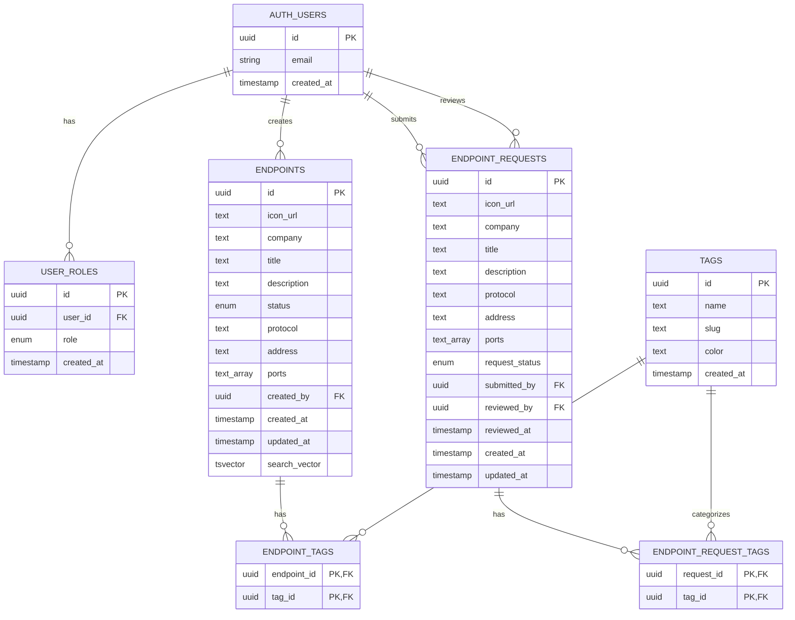
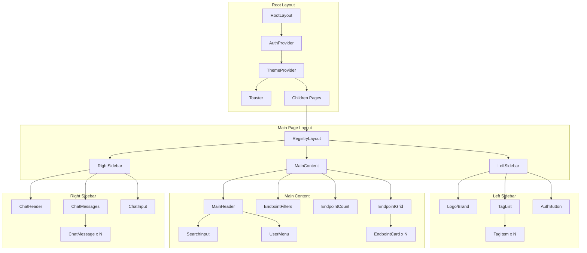
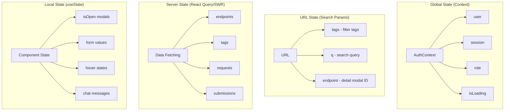
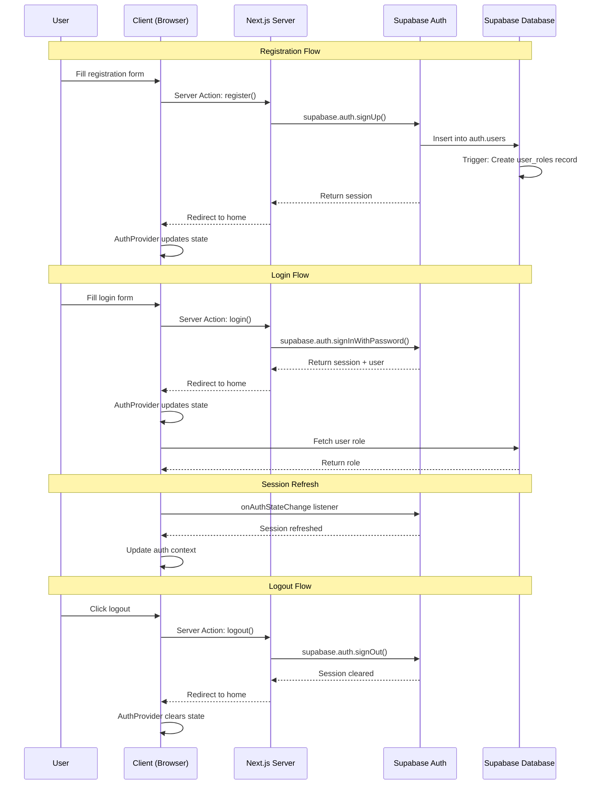

# Low-Level Design: Switchboard API Endpoint Registry

**Document Version:** 1.0
**Created:** 2026-02-04
**Author:** Enterprise Software Architect Agent
**Status:** Final

---

## Table of Contents

1. [Overview](#1-overview)
2. [Database Design](#2-database-design)
3. [Supabase Configuration](#3-supabase-configuration)
4. [Project Structure](#4-project-structure)
5. [Component Architecture](#5-component-architecture)
6. [API Design](#6-api-design)
7. [Authentication Flow](#7-authentication-flow)
8. [UI/UX Specifications](#8-uiux-specifications)
9. [Implementation Tasks](#9-implementation-tasks)
10. [Testing Requirements](#10-testing-requirements)
11. [Risks and Mitigations](#11-risks-and-mitigations)
12. [Appendix](#12-appendix)

---

## 1. Overview

### 1.1 Purpose

This Low-Level Design document provides a complete technical specification for the Switchboard API Endpoint Registry application. It serves as the authoritative blueprint for implementation by Full Stack Engineers and test creation by QA Engineers, enabling parallel development streams.

### 1.2 Scope

**In Scope:**
- Complete PostgreSQL database schema with RLS policies
- Next.js 14+ App Router application structure
- All UI components with props, state, and behavior
- API endpoints and Server Actions
- Authentication and authorization flows
- Responsive three-column layout system

**Out of Scope:**
- AI/LLM integration for chat functionality (UI shell only)
- Social OAuth providers
- Analytics and audit logging
- Rate limiting configuration
- Email templates customization

### 1.3 References

- User Stories: `/home/mschodin/projects/switchboard_v1/docs/user-stories/SWITCHBOARD-USER-STORIES.md`
- React Best Practices: `/home/mschodin/projects/switchboard_v1/.agents/skills/vercel-react-best-practices/AGENTS.md`
- Web Design Guidelines: `/home/mschodin/projects/switchboard_v1/.agents/skills/web-design-guidelines/SKILL.md`

### 1.4 Technology Stack

| Layer | Technology | Version |
|-------|------------|---------|
| Framework | Next.js (App Router) | 14.x+ |
| Language | TypeScript | 5.x |
| UI Components | shadcn/ui | Latest |
| Styling | Tailwind CSS | 3.x |
| Database | PostgreSQL (via Supabase) | 15.x |
| Auth | Supabase Auth | Latest |
| Storage | Supabase Storage | Latest |
| Deployment | Vercel | Latest |

---

## 2. Database Design

### 2.1 Entity Relationship Diagram



### 2.2 Enum Definitions

```sql
-- Endpoint status enum
CREATE TYPE endpoint_status AS ENUM ('active', 'inactive', 'deprecated');

-- Request status enum
CREATE TYPE request_status AS ENUM ('pending', 'approved', 'rejected');

-- User role enum
CREATE TYPE user_role AS ENUM ('user', 'admin');
```

### 2.3 Complete Schema SQL

```sql
-- =============================================================================
-- SWITCHBOARD DATABASE SCHEMA
-- Version: 1.0
-- =============================================================================

-- Enable necessary extensions
CREATE EXTENSION IF NOT EXISTS "uuid-ossp";
CREATE EXTENSION IF NOT EXISTS "pg_trgm";  -- For fuzzy text search

-- =============================================================================
-- ENUM TYPES
-- =============================================================================

CREATE TYPE endpoint_status AS ENUM ('active', 'inactive', 'deprecated');
CREATE TYPE request_status AS ENUM ('pending', 'approved', 'rejected');
CREATE TYPE user_role AS ENUM ('user', 'admin');

-- =============================================================================
-- TABLES
-- =============================================================================

-- -----------------------------------------------------------------------------
-- User Roles Table
-- Stores role assignments for authenticated users
-- -----------------------------------------------------------------------------
CREATE TABLE user_roles (
    id UUID PRIMARY KEY DEFAULT uuid_generate_v4(),
    user_id UUID NOT NULL REFERENCES auth.users(id) ON DELETE CASCADE,
    role user_role NOT NULL DEFAULT 'user',
    created_at TIMESTAMPTZ NOT NULL DEFAULT NOW(),
    updated_at TIMESTAMPTZ NOT NULL DEFAULT NOW(),

    CONSTRAINT user_roles_user_id_unique UNIQUE (user_id)
);

-- Index for faster user role lookups
CREATE INDEX idx_user_roles_user_id ON user_roles(user_id);
CREATE INDEX idx_user_roles_role ON user_roles(role);

-- -----------------------------------------------------------------------------
-- Tags Table
-- Service categories for filtering endpoints
-- -----------------------------------------------------------------------------
CREATE TABLE tags (
    id UUID PRIMARY KEY DEFAULT uuid_generate_v4(),
    name TEXT NOT NULL,
    slug TEXT NOT NULL,
    color TEXT DEFAULT '#6366f1',  -- Default indigo color
    created_at TIMESTAMPTZ NOT NULL DEFAULT NOW(),

    CONSTRAINT tags_name_unique UNIQUE (name),
    CONSTRAINT tags_slug_unique UNIQUE (slug),
    CONSTRAINT tags_slug_format CHECK (slug ~ '^[a-z0-9-]+$')
);

-- Index for tag lookups
CREATE INDEX idx_tags_slug ON tags(slug);
CREATE INDEX idx_tags_name ON tags(name);

-- -----------------------------------------------------------------------------
-- Endpoints Table
-- Main registry of approved API endpoints
-- -----------------------------------------------------------------------------
CREATE TABLE endpoints (
    id UUID PRIMARY KEY DEFAULT uuid_generate_v4(),
    icon_url TEXT,
    company TEXT NOT NULL,
    title TEXT NOT NULL,
    description TEXT,
    status endpoint_status NOT NULL DEFAULT 'active',
    protocol TEXT NOT NULL DEFAULT 'HTTPS',
    address TEXT NOT NULL,
    ports TEXT[],
    created_by UUID REFERENCES auth.users(id) ON DELETE SET NULL,
    created_at TIMESTAMPTZ NOT NULL DEFAULT NOW(),
    updated_at TIMESTAMPTZ NOT NULL DEFAULT NOW(),

    -- Full-text search vector
    search_vector TSVECTOR GENERATED ALWAYS AS (
        setweight(to_tsvector('english', coalesce(title, '')), 'A') ||
        setweight(to_tsvector('english', coalesce(company, '')), 'A') ||
        setweight(to_tsvector('english', coalesce(description, '')), 'B')
    ) STORED,

    CONSTRAINT endpoints_company_not_empty CHECK (char_length(company) > 0),
    CONSTRAINT endpoints_title_not_empty CHECK (char_length(title) > 0),
    CONSTRAINT endpoints_address_not_empty CHECK (char_length(address) > 0)
);

-- Indexes for endpoints
CREATE INDEX idx_endpoints_status ON endpoints(status);
CREATE INDEX idx_endpoints_company ON endpoints(company);
CREATE INDEX idx_endpoints_title ON endpoints(title);
CREATE INDEX idx_endpoints_created_at ON endpoints(created_at DESC);
CREATE INDEX idx_endpoints_search_vector ON endpoints USING GIN(search_vector);
CREATE INDEX idx_endpoints_company_trgm ON endpoints USING GIN(company gin_trgm_ops);
CREATE INDEX idx_endpoints_title_trgm ON endpoints USING GIN(title gin_trgm_ops);

-- -----------------------------------------------------------------------------
-- Endpoint Tags Junction Table
-- Many-to-many relationship between endpoints and tags
-- -----------------------------------------------------------------------------
CREATE TABLE endpoint_tags (
    endpoint_id UUID NOT NULL REFERENCES endpoints(id) ON DELETE CASCADE,
    tag_id UUID NOT NULL REFERENCES tags(id) ON DELETE CASCADE,
    created_at TIMESTAMPTZ NOT NULL DEFAULT NOW(),

    PRIMARY KEY (endpoint_id, tag_id)
);

-- Indexes for junction table queries
CREATE INDEX idx_endpoint_tags_endpoint_id ON endpoint_tags(endpoint_id);
CREATE INDEX idx_endpoint_tags_tag_id ON endpoint_tags(tag_id);

-- -----------------------------------------------------------------------------
-- Endpoint Requests Table
-- Pending submissions awaiting admin approval
-- -----------------------------------------------------------------------------
CREATE TABLE endpoint_requests (
    id UUID PRIMARY KEY DEFAULT uuid_generate_v4(),
    icon_url TEXT,
    company TEXT NOT NULL,
    title TEXT NOT NULL,
    description TEXT,
    protocol TEXT NOT NULL DEFAULT 'HTTPS',
    address TEXT NOT NULL,
    ports TEXT[],
    request_status request_status NOT NULL DEFAULT 'pending',
    submitted_by UUID NOT NULL REFERENCES auth.users(id) ON DELETE CASCADE,
    reviewed_by UUID REFERENCES auth.users(id) ON DELETE SET NULL,
    reviewed_at TIMESTAMPTZ,
    created_at TIMESTAMPTZ NOT NULL DEFAULT NOW(),
    updated_at TIMESTAMPTZ NOT NULL DEFAULT NOW(),

    CONSTRAINT endpoint_requests_company_not_empty CHECK (char_length(company) > 0),
    CONSTRAINT endpoint_requests_title_not_empty CHECK (char_length(title) > 0),
    CONSTRAINT endpoint_requests_address_not_empty CHECK (char_length(address) > 0)
);

-- Indexes for endpoint requests
CREATE INDEX idx_endpoint_requests_status ON endpoint_requests(request_status);
CREATE INDEX idx_endpoint_requests_submitted_by ON endpoint_requests(submitted_by);
CREATE INDEX idx_endpoint_requests_created_at ON endpoint_requests(created_at DESC);

-- -----------------------------------------------------------------------------
-- Endpoint Request Tags Junction Table
-- Tags selected for pending requests
-- -----------------------------------------------------------------------------
CREATE TABLE endpoint_request_tags (
    request_id UUID NOT NULL REFERENCES endpoint_requests(id) ON DELETE CASCADE,
    tag_id UUID NOT NULL REFERENCES tags(id) ON DELETE CASCADE,
    created_at TIMESTAMPTZ NOT NULL DEFAULT NOW(),

    PRIMARY KEY (request_id, tag_id)
);

-- Indexes for junction table queries
CREATE INDEX idx_endpoint_request_tags_request_id ON endpoint_request_tags(request_id);
CREATE INDEX idx_endpoint_request_tags_tag_id ON endpoint_request_tags(tag_id);

-- =============================================================================
-- FUNCTIONS
-- =============================================================================

-- -----------------------------------------------------------------------------
-- Function: Update updated_at timestamp
-- -----------------------------------------------------------------------------
CREATE OR REPLACE FUNCTION update_updated_at_column()
RETURNS TRIGGER AS $$
BEGIN
    NEW.updated_at = NOW();
    RETURN NEW;
END;
$$ LANGUAGE plpgsql;

-- -----------------------------------------------------------------------------
-- Function: Create user role on auth.users insert
-- -----------------------------------------------------------------------------
CREATE OR REPLACE FUNCTION handle_new_user()
RETURNS TRIGGER AS $$
BEGIN
    INSERT INTO public.user_roles (user_id, role)
    VALUES (NEW.id, 'user');
    RETURN NEW;
END;
$$ LANGUAGE plpgsql SECURITY DEFINER;

-- -----------------------------------------------------------------------------
-- Function: Check if user is admin
-- -----------------------------------------------------------------------------
CREATE OR REPLACE FUNCTION is_admin(check_user_id UUID)
RETURNS BOOLEAN AS $$
BEGIN
    RETURN EXISTS (
        SELECT 1 FROM user_roles
        WHERE user_id = check_user_id AND role = 'admin'
    );
END;
$$ LANGUAGE plpgsql SECURITY DEFINER;

-- -----------------------------------------------------------------------------
-- Function: Get current user's role
-- -----------------------------------------------------------------------------
CREATE OR REPLACE FUNCTION get_user_role()
RETURNS user_role AS $$
DECLARE
    user_role_value user_role;
BEGIN
    SELECT role INTO user_role_value
    FROM user_roles
    WHERE user_id = auth.uid();

    RETURN COALESCE(user_role_value, 'user');
END;
$$ LANGUAGE plpgsql SECURITY DEFINER;

-- -----------------------------------------------------------------------------
-- Function: Approve endpoint request
-- Atomically creates endpoint and updates request status
-- -----------------------------------------------------------------------------
CREATE OR REPLACE FUNCTION approve_endpoint_request(request_id UUID)
RETURNS UUID AS $$
DECLARE
    new_endpoint_id UUID;
    request_record endpoint_requests%ROWTYPE;
BEGIN
    -- Verify caller is admin
    IF NOT is_admin(auth.uid()) THEN
        RAISE EXCEPTION 'Unauthorized: Admin access required';
    END IF;

    -- Get the request
    SELECT * INTO request_record
    FROM endpoint_requests
    WHERE id = request_id AND request_status = 'pending';

    IF NOT FOUND THEN
        RAISE EXCEPTION 'Request not found or not pending';
    END IF;

    -- Create the endpoint
    INSERT INTO endpoints (
        icon_url, company, title, description,
        protocol, address, ports, created_by
    ) VALUES (
        request_record.icon_url,
        request_record.company,
        request_record.title,
        request_record.description,
        request_record.protocol,
        request_record.address,
        request_record.ports,
        request_record.submitted_by
    ) RETURNING id INTO new_endpoint_id;

    -- Copy tags from request to endpoint
    INSERT INTO endpoint_tags (endpoint_id, tag_id)
    SELECT new_endpoint_id, tag_id
    FROM endpoint_request_tags
    WHERE request_id = request_record.id;

    -- Update request status
    UPDATE endpoint_requests
    SET
        request_status = 'approved',
        reviewed_by = auth.uid(),
        reviewed_at = NOW(),
        updated_at = NOW()
    WHERE id = request_id;

    RETURN new_endpoint_id;
END;
$$ LANGUAGE plpgsql SECURITY DEFINER;

-- -----------------------------------------------------------------------------
-- Function: Reject endpoint request
-- -----------------------------------------------------------------------------
CREATE OR REPLACE FUNCTION reject_endpoint_request(request_id UUID)
RETURNS VOID AS $$
BEGIN
    -- Verify caller is admin
    IF NOT is_admin(auth.uid()) THEN
        RAISE EXCEPTION 'Unauthorized: Admin access required';
    END IF;

    UPDATE endpoint_requests
    SET
        request_status = 'rejected',
        reviewed_by = auth.uid(),
        reviewed_at = NOW(),
        updated_at = NOW()
    WHERE id = request_id AND request_status = 'pending';

    IF NOT FOUND THEN
        RAISE EXCEPTION 'Request not found or not pending';
    END IF;
END;
$$ LANGUAGE plpgsql SECURITY DEFINER;

-- =============================================================================
-- TRIGGERS
-- =============================================================================

-- Auto-update updated_at on endpoints
CREATE TRIGGER update_endpoints_updated_at
    BEFORE UPDATE ON endpoints
    FOR EACH ROW
    EXECUTE FUNCTION update_updated_at_column();

-- Auto-update updated_at on endpoint_requests
CREATE TRIGGER update_endpoint_requests_updated_at
    BEFORE UPDATE ON endpoint_requests
    FOR EACH ROW
    EXECUTE FUNCTION update_updated_at_column();

-- Auto-update updated_at on user_roles
CREATE TRIGGER update_user_roles_updated_at
    BEFORE UPDATE ON user_roles
    FOR EACH ROW
    EXECUTE FUNCTION update_updated_at_column();

-- Create user role on new user signup
CREATE TRIGGER on_auth_user_created
    AFTER INSERT ON auth.users
    FOR EACH ROW
    EXECUTE FUNCTION handle_new_user();

-- =============================================================================
-- ROW LEVEL SECURITY POLICIES
-- =============================================================================

-- Enable RLS on all tables
ALTER TABLE user_roles ENABLE ROW LEVEL SECURITY;
ALTER TABLE tags ENABLE ROW LEVEL SECURITY;
ALTER TABLE endpoints ENABLE ROW LEVEL SECURITY;
ALTER TABLE endpoint_tags ENABLE ROW LEVEL SECURITY;
ALTER TABLE endpoint_requests ENABLE ROW LEVEL SECURITY;
ALTER TABLE endpoint_request_tags ENABLE ROW LEVEL SECURITY;

-- -----------------------------------------------------------------------------
-- User Roles Policies
-- -----------------------------------------------------------------------------

-- Users can read their own role
CREATE POLICY "Users can view own role"
    ON user_roles FOR SELECT
    USING (auth.uid() = user_id);

-- Admins can view all roles
CREATE POLICY "Admins can view all roles"
    ON user_roles FOR SELECT
    USING (is_admin(auth.uid()));

-- Only admins can update roles
CREATE POLICY "Admins can update roles"
    ON user_roles FOR UPDATE
    USING (is_admin(auth.uid()));

-- System inserts roles via trigger (SECURITY DEFINER)
-- No direct insert policy needed

-- -----------------------------------------------------------------------------
-- Tags Policies
-- -----------------------------------------------------------------------------

-- Everyone can read tags (public)
CREATE POLICY "Tags are viewable by everyone"
    ON tags FOR SELECT
    USING (true);

-- Only admins can insert tags
CREATE POLICY "Admins can insert tags"
    ON tags FOR INSERT
    WITH CHECK (is_admin(auth.uid()));

-- Only admins can update tags
CREATE POLICY "Admins can update tags"
    ON tags FOR UPDATE
    USING (is_admin(auth.uid()));

-- Only admins can delete tags
CREATE POLICY "Admins can delete tags"
    ON tags FOR DELETE
    USING (is_admin(auth.uid()));

-- -----------------------------------------------------------------------------
-- Endpoints Policies
-- -----------------------------------------------------------------------------

-- Public: Everyone can view active endpoints
CREATE POLICY "Active endpoints are viewable by everyone"
    ON endpoints FOR SELECT
    USING (status = 'active');

-- Admins can view all endpoints regardless of status
CREATE POLICY "Admins can view all endpoints"
    ON endpoints FOR SELECT
    USING (is_admin(auth.uid()));

-- Only admins can insert endpoints directly
CREATE POLICY "Admins can insert endpoints"
    ON endpoints FOR INSERT
    WITH CHECK (is_admin(auth.uid()));

-- Only admins can update endpoints
CREATE POLICY "Admins can update endpoints"
    ON endpoints FOR UPDATE
    USING (is_admin(auth.uid()));

-- Only admins can delete endpoints
CREATE POLICY "Admins can delete endpoints"
    ON endpoints FOR DELETE
    USING (is_admin(auth.uid()));

-- -----------------------------------------------------------------------------
-- Endpoint Tags Policies
-- -----------------------------------------------------------------------------

-- Everyone can read endpoint tags (for filtering)
CREATE POLICY "Endpoint tags are viewable by everyone"
    ON endpoint_tags FOR SELECT
    USING (true);

-- Only admins can manage endpoint tags
CREATE POLICY "Admins can insert endpoint tags"
    ON endpoint_tags FOR INSERT
    WITH CHECK (is_admin(auth.uid()));

CREATE POLICY "Admins can delete endpoint tags"
    ON endpoint_tags FOR DELETE
    USING (is_admin(auth.uid()));

-- -----------------------------------------------------------------------------
-- Endpoint Requests Policies
-- -----------------------------------------------------------------------------

-- Users can view their own requests
CREATE POLICY "Users can view own requests"
    ON endpoint_requests FOR SELECT
    USING (auth.uid() = submitted_by);

-- Admins can view all requests
CREATE POLICY "Admins can view all requests"
    ON endpoint_requests FOR SELECT
    USING (is_admin(auth.uid()));

-- Authenticated users can insert requests
CREATE POLICY "Authenticated users can submit requests"
    ON endpoint_requests FOR INSERT
    WITH CHECK (
        auth.uid() IS NOT NULL AND
        auth.uid() = submitted_by AND
        request_status = 'pending'
    );

-- Users cannot update their requests (must resubmit)
-- Admins can update request status
CREATE POLICY "Admins can update requests"
    ON endpoint_requests FOR UPDATE
    USING (is_admin(auth.uid()));

-- Users can delete their own pending requests
CREATE POLICY "Users can delete own pending requests"
    ON endpoint_requests FOR DELETE
    USING (
        auth.uid() = submitted_by AND
        request_status = 'pending'
    );

-- -----------------------------------------------------------------------------
-- Endpoint Request Tags Policies
-- -----------------------------------------------------------------------------

-- Users can view tags on their own requests
CREATE POLICY "Users can view own request tags"
    ON endpoint_request_tags FOR SELECT
    USING (
        EXISTS (
            SELECT 1 FROM endpoint_requests
            WHERE id = request_id AND submitted_by = auth.uid()
        )
    );

-- Admins can view all request tags
CREATE POLICY "Admins can view all request tags"
    ON endpoint_request_tags FOR SELECT
    USING (is_admin(auth.uid()));

-- Authenticated users can add tags to their own requests
CREATE POLICY "Users can add tags to own requests"
    ON endpoint_request_tags FOR INSERT
    WITH CHECK (
        EXISTS (
            SELECT 1 FROM endpoint_requests
            WHERE id = request_id
            AND submitted_by = auth.uid()
            AND request_status = 'pending'
        )
    );

-- Users can remove tags from their own pending requests
CREATE POLICY "Users can remove tags from own pending requests"
    ON endpoint_request_tags FOR DELETE
    USING (
        EXISTS (
            SELECT 1 FROM endpoint_requests
            WHERE id = request_id
            AND submitted_by = auth.uid()
            AND request_status = 'pending'
        )
    );

-- =============================================================================
-- SEED DATA
-- =============================================================================

-- Insert default tags (service categories)
INSERT INTO tags (name, slug, color) VALUES
    ('Authentication', 'authentication', '#ef4444'),
    ('Payments', 'payments', '#22c55e'),
    ('Analytics', 'analytics', '#3b82f6'),
    ('Storage', 'storage', '#f59e0b'),
    ('Communication', 'communication', '#8b5cf6'),
    ('AI/ML', 'ai-ml', '#ec4899'),
    ('Database', 'database', '#06b6d4'),
    ('DevOps', 'devops', '#84cc16'),
    ('Security', 'security', '#f97316'),
    ('Maps & Location', 'maps-location', '#14b8a6');
```

### 2.4 Migration Strategy

**Migration Order:**
1. Enable extensions (uuid-ossp, pg_trgm)
2. Create enum types
3. Create tables (user_roles, tags, endpoints, endpoint_tags, endpoint_requests, endpoint_request_tags)
4. Create functions
5. Create triggers
6. Enable RLS and create policies
7. Insert seed data

**Rollback Procedure:**
```sql
-- Rollback in reverse order
DROP POLICY IF EXISTS ... ON ...;
ALTER TABLE ... DISABLE ROW LEVEL SECURITY;
DROP TRIGGER IF EXISTS ... ON ...;
DROP FUNCTION IF EXISTS ...;
DROP TABLE IF EXISTS endpoint_request_tags;
DROP TABLE IF EXISTS endpoint_requests;
DROP TABLE IF EXISTS endpoint_tags;
DROP TABLE IF EXISTS endpoints;
DROP TABLE IF EXISTS tags;
DROP TABLE IF EXISTS user_roles;
DROP TYPE IF EXISTS user_role;
DROP TYPE IF EXISTS request_status;
DROP TYPE IF EXISTS endpoint_status;
```

---

## 3. Supabase Configuration

### 3.1 Storage Buckets

```javascript
// Bucket: endpoint-icons
{
  name: 'endpoint-icons',
  public: true,
  fileSizeLimit: 2097152, // 2MB
  allowedMimeTypes: ['image/png', 'image/jpeg', 'image/svg+xml', 'image/webp']
}
```

**Storage Policies:**

```sql
-- Anyone can view icons (public bucket)
CREATE POLICY "Public icon access"
ON storage.objects FOR SELECT
USING (bucket_id = 'endpoint-icons');

-- Authenticated users can upload icons
CREATE POLICY "Authenticated users can upload icons"
ON storage.objects FOR INSERT
WITH CHECK (
    bucket_id = 'endpoint-icons' AND
    auth.uid() IS NOT NULL
);

-- Users can update their own uploaded icons
CREATE POLICY "Users can update own icons"
ON storage.objects FOR UPDATE
USING (
    bucket_id = 'endpoint-icons' AND
    auth.uid()::text = (storage.foldername(name))[1]
);

-- Admins can delete any icon
CREATE POLICY "Admins can delete icons"
ON storage.objects FOR DELETE
USING (
    bucket_id = 'endpoint-icons' AND
    is_admin(auth.uid())
);
```

### 3.2 Auth Configuration

```javascript
// Supabase Auth Settings
{
  // Site URL for redirects
  siteUrl: process.env.NEXT_PUBLIC_SITE_URL,

  // Email auth enabled
  externalEmail: {
    enabled: true,
    confirmEmail: false, // Don't require email confirmation initially
    minPasswordLength: 8
  },

  // Disable other providers initially
  externalGoogle: { enabled: false },
  externalGithub: { enabled: false },

  // JWT settings
  jwtExpiry: 3600, // 1 hour
  refreshTokenRotationEnabled: true
}
```

### 3.3 Environment Variables

```bash
# .env.local (client-safe variables)
NEXT_PUBLIC_SUPABASE_URL=https://your-project.supabase.co
NEXT_PUBLIC_SUPABASE_ANON_KEY=your-anon-key
NEXT_PUBLIC_SITE_URL=http://localhost:3000

# .env (server-only variables - NOT in .env.local)
SUPABASE_SERVICE_ROLE_KEY=your-service-role-key
```

---

## 4. Project Structure

### 4.1 Directory Structure

```
switchboard/
├── .env.local                    # Client-safe environment variables
├── .env                          # Server-only environment variables (gitignored)
├── next.config.js                # Next.js configuration
├── tailwind.config.ts            # Tailwind CSS configuration
├── tsconfig.json                 # TypeScript configuration
├── components.json               # shadcn/ui configuration
├── package.json
│
├── public/
│   ├── favicon.ico
│   ├── logo.svg                  # Switchboard logo
│   └── placeholder-icon.svg      # Default endpoint icon
│
├── src/
│   ├── app/                      # Next.js App Router
│   │   ├── layout.tsx            # Root layout with providers
│   │   ├── page.tsx              # Home page (registry)
│   │   ├── loading.tsx           # Root loading state
│   │   ├── error.tsx             # Root error boundary
│   │   ├── not-found.tsx         # 404 page
│   │   ├── globals.css           # Global styles + Tailwind
│   │   │
│   │   ├── (auth)/               # Auth route group (no layout nesting)
│   │   │   ├── login/
│   │   │   │   └── page.tsx      # Login page
│   │   │   └── register/
│   │   │       └── page.tsx      # Registration page
│   │   │
│   │   ├── submit/               # Endpoint submission
│   │   │   └── page.tsx          # Submission form (protected)
│   │   │
│   │   ├── my-submissions/       # User's submissions
│   │   │   └── page.tsx          # Submissions list (protected)
│   │   │
│   │   ├── admin/                # Admin routes
│   │   │   ├── layout.tsx        # Admin layout with guard
│   │   │   ├── page.tsx          # Admin dashboard
│   │   │   ├── requests/
│   │   │   │   └── page.tsx      # Pending requests queue
│   │   │   └── endpoints/
│   │   │       ├── page.tsx      # Manage endpoints
│   │   │       └── new/
│   │   │           └── page.tsx  # Direct endpoint creation
│   │   │
│   │   └── endpoint/
│   │       └── [id]/
│   │           └── page.tsx      # Endpoint detail page
│   │
│   ├── components/               # React components
│   │   ├── ui/                   # shadcn/ui components (auto-generated)
│   │   │   ├── button.tsx
│   │   │   ├── card.tsx
│   │   │   ├── input.tsx
│   │   │   ├── badge.tsx
│   │   │   ├── dropdown-menu.tsx
│   │   │   ├── dialog.tsx
│   │   │   ├── skeleton.tsx
│   │   │   ├── toast.tsx
│   │   │   ├── form.tsx
│   │   │   ├── select.tsx
│   │   │   ├── textarea.tsx
│   │   │   ├── avatar.tsx
│   │   │   └── scroll-area.tsx
│   │   │
│   │   ├── layout/               # Layout components
│   │   │   ├── root-layout.tsx   # Main layout wrapper
│   │   │   ├── left-sidebar.tsx  # Left navigation sidebar
│   │   │   ├── right-sidebar.tsx # Chat sidebar
│   │   │   ├── main-header.tsx   # Header with search & auth
│   │   │   ├── mobile-nav.tsx    # Mobile navigation overlay
│   │   │   └── sidebar-toggle.tsx# Mobile sidebar toggles
│   │   │
│   │   ├── endpoints/            # Endpoint-related components
│   │   │   ├── endpoint-grid.tsx # Grid container for cards
│   │   │   ├── endpoint-card.tsx # Individual endpoint card
│   │   │   ├── endpoint-card-skeleton.tsx
│   │   │   ├── endpoint-detail-modal.tsx
│   │   │   ├── endpoint-form.tsx # Shared form for create/submit
│   │   │   ├── endpoint-filters.tsx # Active filter chips
│   │   │   ├── endpoint-count.tsx# "Showing X of Y" indicator
│   │   │   └── status-badge.tsx  # Status indicator component
│   │   │
│   │   ├── tags/                 # Tag-related components
│   │   │   ├── tag-list.tsx      # Sidebar tag list
│   │   │   ├── tag-badge.tsx     # Colored tag pill
│   │   │   └── tag-select.tsx    # Multi-select for forms
│   │   │
│   │   ├── auth/                 # Auth-related components
│   │   │   ├── auth-provider.tsx # Auth context provider
│   │   │   ├── login-form.tsx    # Login form
│   │   │   ├── register-form.tsx # Registration form
│   │   │   ├── user-menu.tsx     # Header user dropdown
│   │   │   ├── auth-guard.tsx    # Protected route wrapper
│   │   │   └── admin-guard.tsx   # Admin route wrapper
│   │   │
│   │   ├── chat/                 # Chat UI components
│   │   │   ├── chat-container.tsx
│   │   │   ├── chat-header.tsx
│   │   │   ├── chat-messages.tsx
│   │   │   ├── chat-message.tsx
│   │   │   └── chat-input.tsx
│   │   │
│   │   ├── admin/                # Admin-specific components
│   │   │   ├── request-queue.tsx
│   │   │   ├── request-card.tsx
│   │   │   ├── request-detail-modal.tsx
│   │   │   └── admin-stats.tsx
│   │   │
│   │   └── submissions/          # User submissions components
│   │       ├── submissions-list.tsx
│   │       ├── submission-card.tsx
│   │       └── submission-empty-state.tsx
│   │
│   ├── lib/                      # Utility libraries
│   │   ├── supabase/
│   │   │   ├── client.ts         # Browser Supabase client
│   │   │   ├── server.ts         # Server Supabase client
│   │   │   ├── middleware.ts     # Auth middleware helpers
│   │   │   └── storage.ts        # Storage helpers
│   │   │
│   │   ├── utils.ts              # General utilities (cn, etc.)
│   │   ├── constants.ts          # App constants
│   │   └── validators.ts         # Zod schemas
│   │
│   ├── hooks/                    # Custom React hooks
│   │   ├── use-auth.ts           # Auth context hook
│   │   ├── use-endpoints.ts      # Endpoints data hook
│   │   ├── use-tags.ts           # Tags data hook
│   │   ├── use-search.ts         # Search state hook
│   │   ├── use-filters.ts        # Filter state hook (URL sync)
│   │   ├── use-debounce.ts       # Debounce utility hook
│   │   └── use-media-query.ts    # Responsive breakpoint hook
│   │
│   ├── actions/                  # Server Actions
│   │   ├── auth.ts               # Auth-related actions
│   │   ├── endpoints.ts          # Endpoint CRUD actions
│   │   ├── requests.ts           # Request submission/approval
│   │   └── upload.ts             # File upload actions
│   │
│   └── types/                    # TypeScript type definitions
│       ├── database.ts           # Generated Supabase types
│       ├── endpoints.ts          # Endpoint-related types
│       ├── auth.ts               # Auth-related types
│       └── api.ts                # API response types
│
├── supabase/                     # Supabase local dev
│   ├── config.toml               # Supabase project config
│   ├── migrations/               # Database migrations
│   │   └── 001_initial_schema.sql
│   └── seed.sql                  # Seed data
│
└── tests/                        # Test files
    ├── e2e/                      # Playwright E2E tests
    ├── integration/              # Integration tests
    └── unit/                     # Unit tests
```

### 4.2 File Naming Conventions

| Type | Convention | Example |
|------|------------|---------|
| Components | kebab-case | `endpoint-card.tsx` |
| Pages | page.tsx in folder | `app/admin/page.tsx` |
| Hooks | use-[name].ts | `use-auth.ts` |
| Types | [domain].ts | `endpoints.ts` |
| Actions | [domain].ts | `endpoints.ts` |
| Utilities | [name].ts | `validators.ts` |

---

## 5. Component Architecture

### 5.1 Component Hierarchy Diagram



### 5.2 Component Specifications

#### 5.2.1 Layout Components

| Component | File | Props | State | Purpose |
|-----------|------|-------|-------|---------|
| `RootLayout` | `layout/root-layout.tsx` | `children: ReactNode` | None | Wraps app with providers |
| `LeftSidebar` | `layout/left-sidebar.tsx` | `className?: string` | `isCollapsed: boolean` (mobile) | Navigation, tags, auth |
| `RightSidebar` | `layout/right-sidebar.tsx` | `className?: string` | `isCollapsed: boolean` (mobile) | Chat interface |
| `MainHeader` | `layout/main-header.tsx` | None | None | Title, search, user menu |
| `MobileNav` | `layout/mobile-nav.tsx` | `isOpen: boolean`, `onClose: () => void`, `side: 'left' \| 'right'` | None | Mobile overlay sidebar |
| `SidebarToggle` | `layout/sidebar-toggle.tsx` | `side: 'left' \| 'right'`, `onClick: () => void` | None | Mobile hamburger/chat icons |

#### 5.2.2 Endpoint Components

| Component | File | Props | State | Purpose |
|-----------|------|-------|-------|---------|
| `EndpointGrid` | `endpoints/endpoint-grid.tsx` | `endpoints: Endpoint[]`, `isLoading: boolean` | None | Responsive grid container |
| `EndpointCard` | `endpoints/endpoint-card.tsx` | `endpoint: Endpoint`, `onClick?: () => void` | `isHovered: boolean` | Individual endpoint display |
| `EndpointCardSkeleton` | `endpoints/endpoint-card-skeleton.tsx` | None | None | Loading placeholder |
| `EndpointDetailModal` | `endpoints/endpoint-detail-modal.tsx` | `endpoint: Endpoint \| null`, `isOpen: boolean`, `onClose: () => void` | None | Full endpoint details |
| `EndpointForm` | `endpoints/endpoint-form.tsx` | `mode: 'submit' \| 'create'`, `onSuccess?: () => void`, `defaultValues?: Partial<EndpointFormData>` | Form state via react-hook-form | Create/submit endpoint |
| `EndpointFilters` | `endpoints/endpoint-filters.tsx` | `tags: string[]`, `onRemove: (tag: string) => void`, `onClear: () => void` | None | Active filter chips |
| `EndpointCount` | `endpoints/endpoint-count.tsx` | `showing: number`, `total: number` | None | "Showing X of Y" |
| `StatusBadge` | `endpoints/status-badge.tsx` | `status: EndpointStatus` | None | Colored status indicator |

#### 5.2.3 Tag Components

| Component | File | Props | State | Purpose |
|-----------|------|-------|-------|---------|
| `TagList` | `tags/tag-list.tsx` | `selectedTags: string[]`, `onTagClick: (slug: string) => void` | `tags: Tag[]` (fetched) | Sidebar tag list |
| `TagBadge` | `tags/tag-badge.tsx` | `tag: Tag`, `size?: 'sm' \| 'md'` | None | Colored tag pill |
| `TagSelect` | `tags/tag-select.tsx` | `value: string[]`, `onChange: (tags: string[]) => void` | `tags: Tag[]` (fetched) | Multi-select for forms |

#### 5.2.4 Auth Components

| Component | File | Props | State | Purpose |
|-----------|------|-------|-------|---------|
| `AuthProvider` | `auth/auth-provider.tsx` | `children: ReactNode` | `user`, `session`, `isLoading`, `role` | Auth context provider |
| `LoginForm` | `auth/login-form.tsx` | `onSuccess?: () => void`, `redirectTo?: string` | Form state | Login form |
| `RegisterForm` | `auth/register-form.tsx` | `onSuccess?: () => void` | Form state | Registration form |
| `UserMenu` | `auth/user-menu.tsx` | None | `isOpen: boolean` | Header user dropdown |
| `AuthGuard` | `auth/auth-guard.tsx` | `children: ReactNode`, `fallback?: ReactNode` | None | Protected route wrapper |
| `AdminGuard` | `auth/admin-guard.tsx` | `children: ReactNode`, `fallback?: ReactNode` | None | Admin route wrapper |

#### 5.2.5 Chat Components

| Component | File | Props | State | Purpose |
|-----------|------|-------|-------|---------|
| `ChatContainer` | `chat/chat-container.tsx` | None | `messages: ChatMessage[]` | Main chat wrapper |
| `ChatHeader` | `chat/chat-header.tsx` | None | None | "Chat with Switchboard" |
| `ChatMessages` | `chat/chat-messages.tsx` | `messages: ChatMessage[]` | `scrollRef` | Scrollable message list |
| `ChatMessage` | `chat/chat-message.tsx` | `message: ChatMessage` | None | Individual message bubble |
| `ChatInput` | `chat/chat-input.tsx` | `onSend: (message: string) => void`, `disabled?: boolean` | `value: string` | Text input with send |

#### 5.2.6 Admin Components

| Component | File | Props | State | Purpose |
|-----------|------|-------|-------|---------|
| `RequestQueue` | `admin/request-queue.tsx` | None | `requests: EndpointRequest[]`, `isLoading` | Pending requests list |
| `RequestCard` | `admin/request-card.tsx` | `request: EndpointRequest`, `onApprove: () => void`, `onReject: () => void`, `onViewDetails: () => void` | `isProcessing: boolean` | Request with actions |
| `RequestDetailModal` | `admin/request-detail-modal.tsx` | `request: EndpointRequest \| null`, `isOpen: boolean`, `onClose: () => void`, `onApprove: () => void`, `onReject: () => void` | None | Full request details |
| `AdminStats` | `admin/admin-stats.tsx` | None | `stats: AdminStats` (fetched) | Dashboard statistics |

#### 5.2.7 Submissions Components

| Component | File | Props | State | Purpose |
|-----------|------|-------|-------|---------|
| `SubmissionsList` | `submissions/submissions-list.tsx` | None | `submissions: EndpointRequest[]`, `isLoading` | User's submissions |
| `SubmissionCard` | `submissions/submission-card.tsx` | `submission: EndpointRequest` | None | Submission with status |
| `SubmissionEmptyState` | `submissions/submission-empty-state.tsx` | None | None | No submissions CTA |

### 5.3 State Management Approach



**State Management Rules:**

1. **Auth State**: React Context (`AuthProvider`) - global, needed everywhere
2. **Filter/Search State**: URL search params - shareable, persists on refresh
3. **Server Data**: Server Components + Suspense boundaries - SSR optimized
4. **UI State**: Local `useState` - component-scoped ephemeral state
5. **Form State**: react-hook-form - managed form state with validation
6. **Chat Messages**: Local `useState` - non-persistent for MVP

### 5.4 Data Fetching Patterns

**Server Components (Default):**
```typescript
// src/app/page.tsx
import { createServerClient } from '@/lib/supabase/server'

export default async function RegistryPage({
  searchParams
}: {
  searchParams: { tags?: string; q?: string }
}) {
  const supabase = createServerClient()

  // Fetch on server - no loading state needed for initial render
  const { data: endpoints } = await supabase
    .from('endpoints')
    .select('*, endpoint_tags(tag:tags(*))')
    .eq('status', 'active')

  return <EndpointGrid endpoints={endpoints ?? []} />
}
```

**Client Components (Interactive):**
```typescript
// src/components/tags/tag-list.tsx
'use client'

import { useEffect, useState } from 'react'
import { createBrowserClient } from '@/lib/supabase/client'

export function TagList({ selectedTags, onTagClick }: TagListProps) {
  const [tags, setTags] = useState<Tag[]>([])
  const supabase = createBrowserClient()

  useEffect(() => {
    const fetchTags = async () => {
      const { data } = await supabase.from('tags').select('*')
      if (data) setTags(data)
    }
    fetchTags()
  }, [])

  // ... render
}
```

**Suspense Boundaries:**
```typescript
// src/app/page.tsx
import { Suspense } from 'react'
import { EndpointGridSkeleton } from '@/components/endpoints/endpoint-grid-skeleton'

export default function RegistryPage() {
  return (
    <div>
      <MainHeader />
      <Suspense fallback={<EndpointGridSkeleton />}>
        <EndpointGridServer />
      </Suspense>
    </div>
  )
}
```

---

## 6. API Design

### 6.1 Server Actions

Server Actions are the primary API pattern. Each action authenticates internally.

#### 6.1.1 Auth Actions (`/src/actions/auth.ts`)

```typescript
'use server'

import { createServerClient } from '@/lib/supabase/server'
import { redirect } from 'next/navigation'
import { z } from 'zod'

// ============================================================================
// Schemas
// ============================================================================

const loginSchema = z.object({
  email: z.string().email('Invalid email address'),
  password: z.string().min(1, 'Password is required'),
})

const registerSchema = z.object({
  email: z.string().email('Invalid email address'),
  password: z.string()
    .min(8, 'Password must be at least 8 characters')
    .regex(/[a-z]/, 'Password must contain a lowercase letter')
    .regex(/[A-Z]/, 'Password must contain an uppercase letter')
    .regex(/[0-9]/, 'Password must contain a number'),
  confirmPassword: z.string(),
}).refine((data) => data.password === data.confirmPassword, {
  message: 'Passwords do not match',
  path: ['confirmPassword'],
})

// ============================================================================
// Actions
// ============================================================================

export async function login(formData: FormData) {
  const supabase = createServerClient()

  const validated = loginSchema.safeParse({
    email: formData.get('email'),
    password: formData.get('password'),
  })

  if (!validated.success) {
    return { error: validated.error.flatten().fieldErrors }
  }

  const { error } = await supabase.auth.signInWithPassword({
    email: validated.data.email,
    password: validated.data.password,
  })

  if (error) {
    return { error: { root: [error.message] } }
  }

  redirect('/')
}

export async function register(formData: FormData) {
  const supabase = createServerClient()

  const validated = registerSchema.safeParse({
    email: formData.get('email'),
    password: formData.get('password'),
    confirmPassword: formData.get('confirmPassword'),
  })

  if (!validated.success) {
    return { error: validated.error.flatten().fieldErrors }
  }

  const { error } = await supabase.auth.signUp({
    email: validated.data.email,
    password: validated.data.password,
  })

  if (error) {
    if (error.message.includes('already registered')) {
      return { error: { email: ['This email is already registered'] } }
    }
    return { error: { root: [error.message] } }
  }

  return { success: true, message: 'Check your email for confirmation' }
}

export async function logout() {
  const supabase = createServerClient()
  await supabase.auth.signOut()
  redirect('/')
}

export async function getSession() {
  const supabase = createServerClient()
  const { data: { session } } = await supabase.auth.getSession()
  return session
}

export async function getUserRole() {
  const supabase = createServerClient()
  const { data: { user } } = await supabase.auth.getUser()

  if (!user) return null

  const { data } = await supabase
    .from('user_roles')
    .select('role')
    .eq('user_id', user.id)
    .single()

  return data?.role ?? 'user'
}
```

#### 6.1.2 Endpoint Actions (`/src/actions/endpoints.ts`)

```typescript
'use server'

import { createServerClient } from '@/lib/supabase/server'
import { revalidatePath } from 'next/cache'
import { z } from 'zod'

// ============================================================================
// Schemas
// ============================================================================

const endpointSchema = z.object({
  company: z.string().min(1, 'Company name is required').max(100),
  title: z.string().min(1, 'Title is required').max(200),
  description: z.string().max(1000).optional(),
  protocol: z.enum(['HTTP', 'HTTPS', 'gRPC', 'WebSocket', 'TCP', 'UDP']),
  address: z.string().min(1, 'Address is required').max(500),
  ports: z.string().optional().transform(val =>
    val ? val.split(',').map(p => p.trim()).filter(Boolean) : null
  ),
  tagIds: z.array(z.string().uuid()).min(1, 'Select at least one tag'),
  iconUrl: z.string().url().optional().nullable(),
})

export type EndpointFormData = z.infer<typeof endpointSchema>

// ============================================================================
// Actions
// ============================================================================

export async function getEndpoints(options?: {
  tags?: string[]
  search?: string
  status?: 'active' | 'inactive' | 'deprecated'
}) {
  const supabase = createServerClient()

  let query = supabase
    .from('endpoints')
    .select(`
      *,
      endpoint_tags(
        tag:tags(*)
      )
    `)
    .eq('status', options?.status ?? 'active')
    .order('created_at', { ascending: false })

  // Apply search filter
  if (options?.search) {
    query = query.or(
      `title.ilike.%${options.search}%,` +
      `company.ilike.%${options.search}%,` +
      `description.ilike.%${options.search}%`
    )
  }

  const { data, error } = await query

  if (error) throw error

  // Client-side tag filtering (for OR logic across multiple tags)
  let endpoints = data ?? []

  if (options?.tags && options.tags.length > 0) {
    endpoints = endpoints.filter(endpoint => {
      const endpointTagSlugs = endpoint.endpoint_tags
        ?.map((et: any) => et.tag?.slug)
        .filter(Boolean) ?? []
      return options.tags!.some(tag => endpointTagSlugs.includes(tag))
    })
  }

  return endpoints
}

export async function getEndpointById(id: string) {
  const supabase = createServerClient()

  const { data, error } = await supabase
    .from('endpoints')
    .select(`
      *,
      endpoint_tags(
        tag:tags(*)
      )
    `)
    .eq('id', id)
    .single()

  if (error) throw error
  return data
}

export async function createEndpoint(formData: FormData) {
  const supabase = createServerClient()

  // Verify admin
  const { data: { user } } = await supabase.auth.getUser()
  if (!user) {
    return { error: { root: ['Authentication required'] } }
  }

  const { data: roleData } = await supabase
    .from('user_roles')
    .select('role')
    .eq('user_id', user.id)
    .single()

  if (roleData?.role !== 'admin') {
    return { error: { root: ['Admin access required'] } }
  }

  // Validate input
  const validated = endpointSchema.safeParse({
    company: formData.get('company'),
    title: formData.get('title'),
    description: formData.get('description'),
    protocol: formData.get('protocol'),
    address: formData.get('address'),
    ports: formData.get('ports'),
    tagIds: formData.getAll('tagIds'),
    iconUrl: formData.get('iconUrl') || null,
  })

  if (!validated.success) {
    return { error: validated.error.flatten().fieldErrors }
  }

  // Create endpoint
  const { data: endpoint, error: insertError } = await supabase
    .from('endpoints')
    .insert({
      company: validated.data.company,
      title: validated.data.title,
      description: validated.data.description,
      protocol: validated.data.protocol,
      address: validated.data.address,
      ports: validated.data.ports,
      icon_url: validated.data.iconUrl,
      created_by: user.id,
    })
    .select()
    .single()

  if (insertError) {
    return { error: { root: [insertError.message] } }
  }

  // Add tags
  if (validated.data.tagIds.length > 0) {
    await supabase.from('endpoint_tags').insert(
      validated.data.tagIds.map(tagId => ({
        endpoint_id: endpoint.id,
        tag_id: tagId,
      }))
    )
  }

  revalidatePath('/')
  return { success: true, endpoint }
}
```

#### 6.1.3 Request Actions (`/src/actions/requests.ts`)

```typescript
'use server'

import { createServerClient } from '@/lib/supabase/server'
import { revalidatePath } from 'next/cache'
import { z } from 'zod'

// ============================================================================
// Schemas
// ============================================================================

const requestSchema = z.object({
  company: z.string().min(1, 'Company name is required').max(100),
  title: z.string().min(1, 'Title is required').max(200),
  description: z.string().max(1000).optional(),
  protocol: z.enum(['HTTP', 'HTTPS', 'gRPC', 'WebSocket', 'TCP', 'UDP']),
  address: z.string().min(1, 'Address is required').max(500),
  ports: z.string().optional().transform(val =>
    val ? val.split(',').map(p => p.trim()).filter(Boolean) : null
  ),
  tagIds: z.array(z.string().uuid()).min(1, 'Select at least one tag'),
  iconUrl: z.string().url().optional().nullable(),
})

// ============================================================================
// Actions
// ============================================================================

export async function submitEndpointRequest(formData: FormData) {
  const supabase = createServerClient()

  // Verify authenticated
  const { data: { user } } = await supabase.auth.getUser()
  if (!user) {
    return { error: { root: ['You must be logged in to submit an endpoint'] } }
  }

  // Validate input
  const validated = requestSchema.safeParse({
    company: formData.get('company'),
    title: formData.get('title'),
    description: formData.get('description'),
    protocol: formData.get('protocol'),
    address: formData.get('address'),
    ports: formData.get('ports'),
    tagIds: formData.getAll('tagIds'),
    iconUrl: formData.get('iconUrl') || null,
  })

  if (!validated.success) {
    return { error: validated.error.flatten().fieldErrors }
  }

  // Create request
  const { data: request, error: insertError } = await supabase
    .from('endpoint_requests')
    .insert({
      company: validated.data.company,
      title: validated.data.title,
      description: validated.data.description,
      protocol: validated.data.protocol,
      address: validated.data.address,
      ports: validated.data.ports,
      icon_url: validated.data.iconUrl,
      submitted_by: user.id,
    })
    .select()
    .single()

  if (insertError) {
    return { error: { root: [insertError.message] } }
  }

  // Add tags
  if (validated.data.tagIds.length > 0) {
    await supabase.from('endpoint_request_tags').insert(
      validated.data.tagIds.map(tagId => ({
        request_id: request.id,
        tag_id: tagId,
      }))
    )
  }

  revalidatePath('/my-submissions')
  return { success: true, request }
}

export async function getUserSubmissions() {
  const supabase = createServerClient()

  const { data: { user } } = await supabase.auth.getUser()
  if (!user) return []

  const { data, error } = await supabase
    .from('endpoint_requests')
    .select(`
      *,
      endpoint_request_tags(
        tag:tags(*)
      )
    `)
    .eq('submitted_by', user.id)
    .order('created_at', { ascending: false })

  if (error) throw error
  return data ?? []
}

export async function getPendingRequests() {
  const supabase = createServerClient()

  // Verify admin
  const { data: { user } } = await supabase.auth.getUser()
  if (!user) throw new Error('Authentication required')

  const { data: roleData } = await supabase
    .from('user_roles')
    .select('role')
    .eq('user_id', user.id)
    .single()

  if (roleData?.role !== 'admin') {
    throw new Error('Admin access required')
  }

  const { data, error } = await supabase
    .from('endpoint_requests')
    .select(`
      *,
      endpoint_request_tags(
        tag:tags(*)
      ),
      submitter:submitted_by(email)
    `)
    .eq('request_status', 'pending')
    .order('created_at', { ascending: true })

  if (error) throw error
  return data ?? []
}

export async function approveRequest(requestId: string) {
  const supabase = createServerClient()

  // Verify admin
  const { data: { user } } = await supabase.auth.getUser()
  if (!user) {
    return { error: 'Authentication required' }
  }

  const { data: roleData } = await supabase
    .from('user_roles')
    .select('role')
    .eq('user_id', user.id)
    .single()

  if (roleData?.role !== 'admin') {
    return { error: 'Admin access required' }
  }

  // Call the database function for atomic approval
  const { data, error } = await supabase.rpc('approve_endpoint_request', {
    request_id: requestId,
  })

  if (error) {
    return { error: error.message }
  }

  revalidatePath('/')
  revalidatePath('/admin/requests')
  return { success: true, endpointId: data }
}

export async function rejectRequest(requestId: string) {
  const supabase = createServerClient()

  // Verify admin
  const { data: { user } } = await supabase.auth.getUser()
  if (!user) {
    return { error: 'Authentication required' }
  }

  const { data: roleData } = await supabase
    .from('user_roles')
    .select('role')
    .eq('user_id', user.id)
    .single()

  if (roleData?.role !== 'admin') {
    return { error: 'Admin access required' }
  }

  // Call the database function
  const { error } = await supabase.rpc('reject_endpoint_request', {
    request_id: requestId,
  })

  if (error) {
    return { error: error.message }
  }

  revalidatePath('/admin/requests')
  return { success: true }
}

export async function getAdminStats() {
  const supabase = createServerClient()

  // Verify admin (RLS will also enforce this)
  const { data: { user } } = await supabase.auth.getUser()
  if (!user) throw new Error('Authentication required')

  const today = new Date()
  today.setHours(0, 0, 0, 0)

  const [pending, approvedToday, rejectedToday, totalEndpoints] = await Promise.all([
    supabase.from('endpoint_requests').select('id', { count: 'exact' }).eq('request_status', 'pending'),
    supabase.from('endpoint_requests').select('id', { count: 'exact' }).eq('request_status', 'approved').gte('reviewed_at', today.toISOString()),
    supabase.from('endpoint_requests').select('id', { count: 'exact' }).eq('request_status', 'rejected').gte('reviewed_at', today.toISOString()),
    supabase.from('endpoints').select('id', { count: 'exact' }),
  ])

  return {
    pendingCount: pending.count ?? 0,
    approvedTodayCount: approvedToday.count ?? 0,
    rejectedTodayCount: rejectedToday.count ?? 0,
    totalEndpointsCount: totalEndpoints.count ?? 0,
  }
}
```

#### 6.1.4 Upload Actions (`/src/actions/upload.ts`)

```typescript
'use server'

import { createServerClient } from '@/lib/supabase/server'

const ALLOWED_TYPES = ['image/png', 'image/jpeg', 'image/svg+xml', 'image/webp']
const MAX_SIZE = 2 * 1024 * 1024 // 2MB

export async function uploadIcon(formData: FormData) {
  const supabase = createServerClient()

  // Verify authenticated
  const { data: { user } } = await supabase.auth.getUser()
  if (!user) {
    return { error: 'Authentication required' }
  }

  const file = formData.get('file') as File
  if (!file) {
    return { error: 'No file provided' }
  }

  // Validate file type
  if (!ALLOWED_TYPES.includes(file.type)) {
    return { error: 'Invalid file type. Allowed: PNG, JPG, SVG, WebP' }
  }

  // Validate file size
  if (file.size > MAX_SIZE) {
    return { error: 'File too large. Maximum size: 2MB' }
  }

  // Generate unique filename
  const ext = file.name.split('.').pop()
  const filename = `${user.id}/${Date.now()}.${ext}`

  // Upload to Supabase Storage
  const { data, error } = await supabase.storage
    .from('endpoint-icons')
    .upload(filename, file, {
      cacheControl: '3600',
      upsert: false,
    })

  if (error) {
    return { error: error.message }
  }

  // Get public URL
  const { data: { publicUrl } } = supabase.storage
    .from('endpoint-icons')
    .getPublicUrl(data.path)

  return { success: true, url: publicUrl }
}
```

### 6.2 Tags Actions (`/src/actions/tags.ts`)

```typescript
'use server'

import { createServerClient } from '@/lib/supabase/server'

export async function getTags() {
  const supabase = createServerClient()

  const { data, error } = await supabase
    .from('tags')
    .select('*')
    .order('name', { ascending: true })

  if (error) throw error
  return data ?? []
}

export async function getTagsWithCounts() {
  const supabase = createServerClient()

  const { data: tags, error: tagsError } = await supabase
    .from('tags')
    .select('*')
    .order('name', { ascending: true })

  if (tagsError) throw tagsError

  const { data: counts, error: countsError } = await supabase
    .from('endpoint_tags')
    .select('tag_id')

  if (countsError) throw countsError

  // Calculate counts
  const countMap = (counts ?? []).reduce((acc, { tag_id }) => {
    acc[tag_id] = (acc[tag_id] || 0) + 1
    return acc
  }, {} as Record<string, number>)

  return (tags ?? []).map(tag => ({
    ...tag,
    count: countMap[tag.id] || 0,
  }))
}
```

### 6.3 API Response Types (`/src/types/api.ts`)

```typescript
// Generic API response wrapper
export type ActionResult<T = void> =
  | { success: true; data?: T; message?: string }
  | { error: string | Record<string, string[]> }

// Auth response types
export interface LoginResult {
  success?: boolean
  error?: Record<string, string[]>
}

export interface RegisterResult {
  success?: boolean
  message?: string
  error?: Record<string, string[]>
}

// Endpoint response types
export interface EndpointWithTags {
  id: string
  icon_url: string | null
  company: string
  title: string
  description: string | null
  status: 'active' | 'inactive' | 'deprecated'
  protocol: string
  address: string
  ports: string[] | null
  created_by: string | null
  created_at: string
  updated_at: string
  endpoint_tags: {
    tag: {
      id: string
      name: string
      slug: string
      color: string
    }
  }[]
}

// Request response types
export interface RequestWithTags {
  id: string
  icon_url: string | null
  company: string
  title: string
  description: string | null
  protocol: string
  address: string
  ports: string[] | null
  request_status: 'pending' | 'approved' | 'rejected'
  submitted_by: string
  reviewed_by: string | null
  reviewed_at: string | null
  created_at: string
  updated_at: string
  endpoint_request_tags: {
    tag: {
      id: string
      name: string
      slug: string
      color: string
    }
  }[]
  submitter?: {
    email: string
  }
}

// Admin stats type
export interface AdminStats {
  pendingCount: number
  approvedTodayCount: number
  rejectedTodayCount: number
  totalEndpointsCount: number
}
```

---

## 7. Authentication Flow

### 7.1 Auth Context Implementation

```typescript
// /src/components/auth/auth-provider.tsx
'use client'

import { createContext, useContext, useEffect, useState } from 'react'
import { createBrowserClient } from '@/lib/supabase/client'
import type { User, Session } from '@supabase/supabase-js'

type UserRole = 'user' | 'admin' | null

interface AuthContextType {
  user: User | null
  session: Session | null
  role: UserRole
  isLoading: boolean
  isAuthenticated: boolean
  isAdmin: boolean
}

const AuthContext = createContext<AuthContextType>({
  user: null,
  session: null,
  role: null,
  isLoading: true,
  isAuthenticated: false,
  isAdmin: false,
})

export function AuthProvider({ children }: { children: React.ReactNode }) {
  const [user, setUser] = useState<User | null>(null)
  const [session, setSession] = useState<Session | null>(null)
  const [role, setRole] = useState<UserRole>(null)
  const [isLoading, setIsLoading] = useState(true)

  const supabase = createBrowserClient()

  useEffect(() => {
    // Get initial session
    const initAuth = async () => {
      const { data: { session } } = await supabase.auth.getSession()
      setSession(session)
      setUser(session?.user ?? null)

      if (session?.user) {
        // Fetch user role
        const { data } = await supabase
          .from('user_roles')
          .select('role')
          .eq('user_id', session.user.id)
          .single()
        setRole(data?.role ?? 'user')
      }

      setIsLoading(false)
    }

    initAuth()

    // Listen for auth changes
    const { data: { subscription } } = supabase.auth.onAuthStateChange(
      async (event, session) => {
        setSession(session)
        setUser(session?.user ?? null)

        if (session?.user) {
          const { data } = await supabase
            .from('user_roles')
            .select('role')
            .eq('user_id', session.user.id)
            .single()
          setRole(data?.role ?? 'user')
        } else {
          setRole(null)
        }
      }
    )

    return () => subscription.unsubscribe()
  }, [supabase])

  return (
    <AuthContext.Provider
      value={{
        user,
        session,
        role,
        isLoading,
        isAuthenticated: !!user,
        isAdmin: role === 'admin',
      }}
    >
      {children}
    </AuthContext.Provider>
  )
}

export const useAuth = () => useContext(AuthContext)
```

### 7.2 Auth Guard Component

```typescript
// /src/components/auth/auth-guard.tsx
'use client'

import { useAuth } from './auth-provider'
import { redirect } from 'next/navigation'
import { useEffect } from 'react'

interface AuthGuardProps {
  children: React.ReactNode
  fallback?: React.ReactNode
}

export function AuthGuard({ children, fallback }: AuthGuardProps) {
  const { isAuthenticated, isLoading } = useAuth()

  useEffect(() => {
    if (!isLoading && !isAuthenticated) {
      redirect('/login')
    }
  }, [isLoading, isAuthenticated])

  if (isLoading) {
    return fallback ?? <div>Loading...</div>
  }

  if (!isAuthenticated) {
    return null
  }

  return <>{children}</>
}
```

### 7.3 Admin Guard Component

```typescript
// /src/components/auth/admin-guard.tsx
'use client'

import { useAuth } from './auth-provider'
import { redirect } from 'next/navigation'
import { useEffect } from 'react'

interface AdminGuardProps {
  children: React.ReactNode
  fallback?: React.ReactNode
}

export function AdminGuard({ children, fallback }: AdminGuardProps) {
  const { isAdmin, isLoading, isAuthenticated } = useAuth()

  useEffect(() => {
    if (!isLoading) {
      if (!isAuthenticated) {
        redirect('/login')
      } else if (!isAdmin) {
        redirect('/')
      }
    }
  }, [isLoading, isAuthenticated, isAdmin])

  if (isLoading) {
    return fallback ?? <div>Loading...</div>
  }

  if (!isAdmin) {
    return null
  }

  return <>{children}</>
}
```

### 7.4 Auth Flow Sequence Diagram



### 7.5 Supabase Client Configuration

```typescript
// /src/lib/supabase/client.ts
import { createBrowserClient as createClient } from '@supabase/ssr'

export function createBrowserClient() {
  return createClient(
    process.env.NEXT_PUBLIC_SUPABASE_URL!,
    process.env.NEXT_PUBLIC_SUPABASE_ANON_KEY!
  )
}

// /src/lib/supabase/server.ts
import { createServerClient as createClient } from '@supabase/ssr'
import { cookies } from 'next/headers'

export function createServerClient() {
  const cookieStore = cookies()

  return createClient(
    process.env.NEXT_PUBLIC_SUPABASE_URL!,
    process.env.NEXT_PUBLIC_SUPABASE_ANON_KEY!,
    {
      cookies: {
        getAll() {
          return cookieStore.getAll()
        },
        setAll(cookiesToSet) {
          try {
            cookiesToSet.forEach(({ name, value, options }) =>
              cookieStore.set(name, value, options)
            )
          } catch {
            // Server Component - ignore
          }
        },
      },
    }
  )
}
```

---

## 8. UI/UX Specifications

### 8.1 Layout Structure

```
+------------------------------------------------------------------+
|                          BROWSER VIEWPORT                         |
+------------------------------------------------------------------+
|  LEFT SIDEBAR  |        MAIN CONTENT         |   RIGHT SIDEBAR   |
|     280px      |          flexible           |       360px       |
|                |        (min: 400px)         |                   |
|  +---------+   |  +---------------------+    |  +-------------+  |
|  | Logo    |   |  | Header              |    |  | Chat Header |  |
|  +---------+   |  | - Title             |    |  +-------------+  |
|                |  | - Search    [User]  |    |                   |
|  +---------+   |  +---------------------+    |  +-------------+  |
|  | Tags    |   |                             |  | Messages    |  |
|  | Filter  |   |  +---------------------+    |  | (scroll)    |  |
|  | List    |   |  | Filter Chips        |    |  |             |  |
|  |         |   |  | Showing X of Y      |    |  |             |  |
|  |         |   |  +---------------------+    |  |             |  |
|  |         |   |                             |  |             |  |
|  |         |   |  +---------------------+    |  +-------------+  |
|  |         |   |  | Endpoint Grid       |    |                   |
|  |         |   |  | (responsive)        |    |  +-------------+  |
|  +---------+   |  |                     |    |  | Input       |  |
|                |  |                     |    |  | [Send]      |  |
|  +---------+   |  |                     |    |  +-------------+  |
|  | Auth    |   |  +---------------------+    |                   |
|  | Button  |   |                             |                   |
|  +---------+   |                             |                   |
+------------------------------------------------------------------+
```

### 8.2 Responsive Breakpoints

| Breakpoint | Width | Layout Behavior |
|------------|-------|-----------------|
| Mobile | < 768px | Both sidebars hidden; hamburger menu (left) + chat icon (right) toggle overlays |
| Tablet | 768px - 1024px | Left sidebar visible; right sidebar toggleable overlay |
| Desktop | > 1024px | All three columns visible |

```css
/* Tailwind breakpoint usage */
.layout {
  @apply flex;
}

.left-sidebar {
  @apply hidden md:flex md:w-[280px] md:flex-shrink-0;
}

.main-content {
  @apply flex-1 min-w-0;
}

.right-sidebar {
  @apply hidden lg:flex lg:w-[360px] lg:flex-shrink-0;
}
```

### 8.3 Design Tokens

```typescript
// tailwind.config.ts
import type { Config } from 'tailwindcss'

const config: Config = {
  darkMode: ['class'],
  content: ['./src/**/*.{ts,tsx}'],
  theme: {
    extend: {
      colors: {
        // Brand colors
        brand: {
          50: '#eef2ff',
          100: '#e0e7ff',
          500: '#6366f1',  // Primary brand (indigo)
          600: '#4f46e5',
          700: '#4338ca',
        },
        // Status colors
        status: {
          active: '#22c55e',      // Green
          inactive: '#eab308',    // Yellow
          deprecated: '#ef4444',  // Red
        },
        // Semantic colors
        background: 'hsl(var(--background))',
        foreground: 'hsl(var(--foreground))',
        card: {
          DEFAULT: 'hsl(var(--card))',
          foreground: 'hsl(var(--card-foreground))',
        },
        primary: {
          DEFAULT: 'hsl(var(--primary))',
          foreground: 'hsl(var(--primary-foreground))',
        },
        secondary: {
          DEFAULT: 'hsl(var(--secondary))',
          foreground: 'hsl(var(--secondary-foreground))',
        },
        muted: {
          DEFAULT: 'hsl(var(--muted))',
          foreground: 'hsl(var(--muted-foreground))',
        },
        accent: {
          DEFAULT: 'hsl(var(--accent))',
          foreground: 'hsl(var(--accent-foreground))',
        },
        destructive: {
          DEFAULT: 'hsl(var(--destructive))',
          foreground: 'hsl(var(--destructive-foreground))',
        },
        border: 'hsl(var(--border))',
        input: 'hsl(var(--input))',
        ring: 'hsl(var(--ring))',
      },
      spacing: {
        'sidebar-left': '280px',
        'sidebar-right': '360px',
      },
      borderRadius: {
        lg: 'var(--radius)',
        md: 'calc(var(--radius) - 2px)',
        sm: 'calc(var(--radius) - 4px)',
      },
      fontFamily: {
        sans: ['var(--font-geist-sans)', 'system-ui', 'sans-serif'],
        mono: ['var(--font-geist-mono)', 'monospace'],
      },
    },
  },
  plugins: [require('tailwindcss-animate')],
}

export default config
```

### 8.4 shadcn/ui Components Required

| Component | Usage | Customization |
|-----------|-------|---------------|
| `Button` | All interactive buttons | Primary, secondary, ghost, destructive variants |
| `Card` | Endpoint cards, submission cards | Custom hover shadow |
| `Input` | Search, form fields | With icons support |
| `Badge` | Tags, status indicators | Custom colors per tag |
| `DropdownMenu` | User menu | Standard implementation |
| `Dialog` | Login/register modals, endpoint details | Full-screen on mobile |
| `Skeleton` | Loading states | Match card dimensions |
| `Toast` | Success/error notifications | Position bottom-right |
| `Form` | All forms | With react-hook-form |
| `Select` | Protocol select, tag multi-select | Custom multi-select wrapper |
| `Textarea` | Description fields | Auto-resize |
| `Avatar` | User icon in header | Fallback to initials |
| `ScrollArea` | Chat messages, tag list | Custom scrollbar styling |

### 8.5 Endpoint Card Design Specification

```
+------------------------------------------+
|  +----+  Company Name                    |
|  |Icon|  Endpoint Title (truncated...)   |
|  +----+                                  |
|                                          |
|  Description text that can span          |
|  multiple lines but is limited to        |
|  150 characters with ellipsis...         |
|                                          |
|  [Tag 1] [Tag 2] [Tag 3] +2 more         |
|                                          |
|  [Status Dot] Active                     |
+------------------------------------------+
```

**Dimensions:**
- Card width: Responsive (CSS Grid auto-fill)
- Minimum card width: 280px
- Card padding: 16px (p-4)
- Icon size: 48x48px
- Gap between cards: 16px (gap-4)

**Hover Effect:**
```css
.endpoint-card {
  @apply transition-shadow duration-200;
  @apply hover:shadow-lg hover:shadow-brand-500/10;
}
```

### 8.6 Typography Scale

| Element | Class | Size | Weight |
|---------|-------|------|--------|
| Page Title | `text-2xl font-semibold` | 24px | 600 |
| Card Title | `text-lg font-medium` | 18px | 500 |
| Card Company | `text-sm font-medium text-muted-foreground` | 14px | 500 |
| Card Description | `text-sm text-muted-foreground` | 14px | 400 |
| Tag Badge | `text-xs font-medium` | 12px | 500 |
| Button | `text-sm font-medium` | 14px | 500 |
| Input Label | `text-sm font-medium` | 14px | 500 |
| Helper Text | `text-xs text-muted-foreground` | 12px | 400 |

### 8.7 Form Field Specifications

**Endpoint Form Fields:**

| Field | Type | Validation | UI Component |
|-------|------|------------|--------------|
| Icon | File Upload | PNG/JPG/SVG/WebP, max 2MB | Custom FileUpload with preview |
| Company | Text | Required, max 100 chars | Input |
| Title | Text | Required, max 200 chars | Input |
| Description | Textarea | Optional, max 1000 chars | Textarea with char count |
| Tags | Multi-select | At least 1 required | Custom TagSelect |
| Protocol | Select | Required, from enum | Select |
| Address | Text | Required, max 500 chars | Input |
| Ports | Text | Optional, comma-separated | Input with helper text |

---

## 9. Implementation Tasks

### 9.1 Sprint 1: Foundation (13 Story Points)

| # | Task | Story | Description | Dependencies | Estimate | Assignable |
|---|------|-------|-------------|--------------|----------|------------|
| 1.1 | Initialize Next.js Project | SWB-001 | Create Next.js 14 project with TypeScript, Tailwind, shadcn/ui | None | 2h | FE |
| 1.2 | Configure Supabase Project | SWB-001 | Create Supabase project, configure env vars | 1.1 | 1h | FE/BE |
| 1.3 | Create Database Migration | SWB-001 | Implement complete schema SQL | 1.2 | 4h | BE |
| 1.4 | Implement RLS Policies | SWB-001 | Add all Row Level Security policies | 1.3 | 3h | BE |
| 1.5 | Create Supabase Clients | SWB-002 | Browser and server client utilities | 1.2 | 1h | FE |
| 1.6 | Implement AuthProvider | SWB-002 | Auth context with session management | 1.5 | 3h | FE |
| 1.7 | Create Auth Server Actions | SWB-002 | login, register, logout actions | 1.5 | 2h | FE |
| 1.8 | Create Auth Guards | SWB-002 | AuthGuard and AdminGuard components | 1.6 | 1h | FE |
| 1.9 | Implement Root Layout | SWB-003 | Three-column responsive layout | 1.1 | 3h | FE |
| 1.10 | Create LeftSidebar Shell | SWB-003 | Sidebar structure without content | 1.9 | 1h | FE |
| 1.11 | Create RightSidebar Shell | SWB-003 | Chat sidebar structure | 1.9 | 1h | FE |
| 1.12 | Implement Mobile Navigation | SWB-003 | Toggle overlays for mobile | 1.9 | 2h | FE |
| 1.13 | Create EndpointCard Component | SWB-004 | Card with all visual elements | 1.1 | 3h | FE |
| 1.14 | Create EndpointCardSkeleton | SWB-004 | Loading placeholder | 1.13 | 30m | FE |
| 1.15 | Create EndpointGrid Component | SWB-004 | Responsive grid container | 1.13 | 1h | FE |
| 1.16 | Implement Endpoint Fetching | SWB-004 | Server action + data display | 1.3, 1.15 | 2h | FE |
| 1.17 | Create TagBadge Component | SWB-005 | Colored tag pill | 1.1 | 30m | FE |
| 1.18 | Create TagList Component | SWB-005 | Sidebar tag list with counts | 1.17, 1.3 | 2h | FE |
| 1.19 | Implement Sidebar Auth Button | SWB-005 | Conditional Login/Register button | 1.6, 1.10 | 1h | FE |

### 9.2 Sprint 2: Core Functionality (12 Story Points)

| # | Task | Story | Description | Dependencies | Estimate | Assignable |
|---|------|-------|-------------|--------------|----------|------------|
| 2.1 | Implement Filter URL State | SWB-006 | useFilters hook with URL sync | 1.1 | 2h | FE |
| 2.2 | Connect TagList to Filters | SWB-006 | Tag click updates filters | 2.1, 1.18 | 1h | FE |
| 2.3 | Create EndpointFilters Component | SWB-006 | Active filter chips display | 2.1 | 1h | FE |
| 2.4 | Implement Filter Logic | SWB-006 | Apply tag filters to endpoint query | 2.1, 1.16 | 2h | FE |
| 2.5 | Create EndpointCount Component | SWB-006 | "Showing X of Y" indicator | 2.4 | 30m | FE |
| 2.6 | Create SearchInput Component | SWB-007 | Search input with clear button | 1.1 | 1h | FE |
| 2.7 | Implement useSearch Hook | SWB-007 | Debounced search with URL sync | 2.6 | 1h | FE |
| 2.8 | Implement Search Query | SWB-007 | Add search to endpoint fetching | 2.7, 1.16 | 2h | FE |
| 2.9 | Create No Results State | SWB-007 | Empty state for no matches | 2.8 | 30m | FE |
| 2.10 | Create MainHeader Component | SWB-008 | Header with title and layout | 1.9 | 1h | FE |
| 2.11 | Create UserMenu Component | SWB-008 | Dropdown with auth options | 1.6, 2.10 | 2h | FE |
| 2.12 | Create LoginForm Component | SWB-009 | Form with validation | 1.7 | 2h | FE |
| 2.13 | Create RegisterForm Component | SWB-009 | Form with password rules | 1.7 | 2h | FE |
| 2.14 | Create Login Page | SWB-009 | Page routing and layout | 2.12 | 1h | FE |
| 2.15 | Create Register Page | SWB-009 | Page routing and layout | 2.13 | 1h | FE |
| 2.16 | Create Icon Upload Component | SWB-010 | File upload with preview | 1.1 | 2h | FE |
| 2.17 | Implement Upload Action | SWB-010 | Server action for file upload | 1.2 | 1h | FE |
| 2.18 | Create EndpointForm Component | SWB-010 | Shared form for submit/create | 2.16, 1.1 | 4h | FE |
| 2.19 | Create Submit Request Action | SWB-010 | Server action for submissions | 1.3 | 2h | FE |
| 2.20 | Create Submit Page | SWB-010 | Protected submission page | 2.18, 2.19 | 1h | FE |

### 9.3 Sprint 3: Admin & Polish (14 Story Points)

| # | Task | Story | Description | Dependencies | Estimate | Assignable |
|---|------|-------|-------------|--------------|----------|------------|
| 3.1 | Create SubmissionCard Component | SWB-011 | Card with status badge | 1.13 | 1h | FE |
| 3.2 | Create SubmissionsList Component | SWB-011 | List of user submissions | 3.1 | 1h | FE |
| 3.3 | Create SubmissionEmptyState | SWB-011 | CTA for first submission | 1.1 | 30m | FE |
| 3.4 | Implement Get User Submissions | SWB-011 | Server action for fetching | 1.3 | 1h | FE |
| 3.5 | Create My Submissions Page | SWB-011 | Protected page with list | 3.2, 3.4 | 1h | FE |
| 3.6 | Create AdminStats Component | SWB-012 | Dashboard statistics | 1.1 | 1h | FE |
| 3.7 | Implement Get Admin Stats | SWB-012 | Server action for counts | 1.3 | 1h | FE |
| 3.8 | Create RequestCard Component | SWB-012 | Card with approve/reject | 3.1 | 2h | FE |
| 3.9 | Create RequestDetailModal | SWB-012 | Full request details view | 3.8 | 2h | FE |
| 3.10 | Create RequestQueue Component | SWB-012 | List of pending requests | 3.8 | 1h | FE |
| 3.11 | Implement Approve/Reject Actions | SWB-012 | Server actions with DB function | 1.3 | 2h | FE |
| 3.12 | Create Admin Layout | SWB-012 | Layout with AdminGuard | 1.8 | 1h | FE |
| 3.13 | Create Admin Dashboard Page | SWB-012 | Stats and navigation | 3.6, 3.12 | 1h | FE |
| 3.14 | Create Admin Requests Page | SWB-012 | Queue with actions | 3.10, 3.11 | 1h | FE |
| 3.15 | Create Admin Direct Create Page | SWB-013 | Form in create mode | 2.18, 3.12 | 1h | FE |
| 3.16 | Implement Direct Create Action | SWB-013 | Admin endpoint creation | 1.3 | 1h | FE |
| 3.17 | Create ChatMessage Component | SWB-014 | User/assistant message bubble | 1.1 | 1h | FE |
| 3.18 | Create ChatMessages Component | SWB-014 | Scrollable message list | 3.17 | 1h | FE |
| 3.19 | Create ChatInput Component | SWB-014 | Input with send button | 1.1 | 1h | FE |
| 3.20 | Create ChatContainer Component | SWB-014 | Full chat interface | 3.18, 3.19 | 1h | FE |
| 3.21 | Implement Mock Chat Response | SWB-014 | "Coming soon" response | 3.20 | 30m | FE |
| 3.22 | Create EndpointDetailModal | SWB-015 | Full endpoint details | 1.13 | 2h | FE |
| 3.23 | Implement Copy to Clipboard | SWB-015 | Copy address button | 3.22 | 30m | FE |
| 3.24 | Connect Detail Modal to Grid | SWB-015 | Click card opens modal | 3.22, 1.15 | 1h | FE |

### 9.4 Task Dependency Graph

```mermaid
graph TD
    subgraph "Sprint 1: Foundation"
        T1.1[1.1 Init Project] --> T1.5[1.5 Supabase Clients]
        T1.1 --> T1.9[1.9 Root Layout]
        T1.1 --> T1.13[1.13 EndpointCard]

        T1.2[1.2 Config Supabase] --> T1.3[1.3 DB Migration]
        T1.3 --> T1.4[1.4 RLS Policies]

        T1.5 --> T1.6[1.6 AuthProvider]
        T1.5 --> T1.7[1.7 Auth Actions]

        T1.6 --> T1.8[1.8 Auth Guards]

        T1.9 --> T1.10[1.10 LeftSidebar]
        T1.9 --> T1.11[1.11 RightSidebar]
        T1.9 --> T1.12[1.12 Mobile Nav]

        T1.13 --> T1.14[1.14 Skeleton]
        T1.13 --> T1.15[1.15 EndpointGrid]
        T1.3 --> T1.16[1.16 Endpoint Fetch]
        T1.15 --> T1.16

        T1.1 --> T1.17[1.17 TagBadge]
        T1.17 --> T1.18[1.18 TagList]
        T1.3 --> T1.18

        T1.6 --> T1.19[1.19 Sidebar Auth]
        T1.10 --> T1.19
    end

    subgraph "Sprint 2: Core"
        T1.1 --> T2.1[2.1 Filter URL State]
        T2.1 --> T2.2[2.2 TagList Filters]
        T1.18 --> T2.2
        T2.1 --> T2.3[2.3 Filter Chips]
        T2.1 --> T2.4[2.4 Filter Logic]
        T1.16 --> T2.4
        T2.4 --> T2.5[2.5 EndpointCount]

        T1.1 --> T2.6[2.6 SearchInput]
        T2.6 --> T2.7[2.7 useSearch]
        T2.7 --> T2.8[2.8 Search Query]
        T1.16 --> T2.8
        T2.8 --> T2.9[2.9 No Results]

        T1.9 --> T2.10[2.10 MainHeader]
        T1.6 --> T2.11[2.11 UserMenu]
        T2.10 --> T2.11

        T1.7 --> T2.12[2.12 LoginForm]
        T1.7 --> T2.13[2.13 RegisterForm]
        T2.12 --> T2.14[2.14 Login Page]
        T2.13 --> T2.15[2.15 Register Page]

        T1.1 --> T2.16[2.16 Icon Upload]
        T1.2 --> T2.17[2.17 Upload Action]
        T2.16 --> T2.18[2.18 EndpointForm]
        T1.3 --> T2.19[2.19 Submit Action]
        T2.18 --> T2.20[2.20 Submit Page]
        T2.19 --> T2.20
    end

    subgraph "Sprint 3: Admin & Polish"
        T1.13 --> T3.1[3.1 SubmissionCard]
        T3.1 --> T3.2[3.2 SubmissionsList]
        T1.1 --> T3.3[3.3 EmptyState]
        T1.3 --> T3.4[3.4 Get Submissions]
        T3.2 --> T3.5[3.5 My Submissions Page]
        T3.4 --> T3.5

        T1.1 --> T3.6[3.6 AdminStats]
        T1.3 --> T3.7[3.7 Get Stats Action]
        T3.1 --> T3.8[3.8 RequestCard]
        T3.8 --> T3.9[3.9 RequestDetail]
        T3.8 --> T3.10[3.10 RequestQueue]
        T1.3 --> T3.11[3.11 Approve/Reject]
        T1.8 --> T3.12[3.12 Admin Layout]
        T3.6 --> T3.13[3.13 Admin Dashboard]
        T3.12 --> T3.13
        T3.10 --> T3.14[3.14 Admin Requests]
        T3.11 --> T3.14
        T2.18 --> T3.15[3.15 Admin Create]
        T3.12 --> T3.15
        T1.3 --> T3.16[3.16 Create Action]

        T1.1 --> T3.17[3.17 ChatMessage]
        T3.17 --> T3.18[3.18 ChatMessages]
        T1.1 --> T3.19[3.19 ChatInput]
        T3.18 --> T3.20[3.20 ChatContainer]
        T3.19 --> T3.20
        T3.20 --> T3.21[3.21 Mock Response]

        T1.13 --> T3.22[3.22 EndpointDetail]
        T3.22 --> T3.23[3.23 Copy Clipboard]
        T3.22 --> T3.24[3.24 Detail Connect]
        T1.15 --> T3.24
    end
```



---

## 10. Testing Requirements

### 10.1 Unit Tests

| Component/Function | Test Cases | Priority |
|--------------------|------------|----------|
| `EndpointCard` | Renders all fields, truncates description, shows max 3 tags with "+N more" | High |
| `StatusBadge` | Correct color for each status, accessible text | High |
| `TagBadge` | Renders with correct color, handles missing color | Medium |
| `LoginForm` | Validation errors, successful submission, loading state | High |
| `RegisterForm` | Password validation, matching passwords, email format | High |
| `EndpointForm` | All field validations, file upload preview | High |
| `UserMenu` | Auth state variations, dropdown behavior | Medium |
| `useFilters` | URL sync, add/remove tags, clear all | High |
| `useSearch` | Debouncing, URL sync, clear search | High |
| `useAuth` | Session state, role detection, loading state | High |

### 10.2 Integration Tests

| Flow | Setup | Assertions |
|------|-------|------------|
| User Registration | Mock Supabase auth | Creates user, shows success message, creates user_role |
| User Login | Mock Supabase auth | Authenticates, updates context, redirects |
| Endpoint Filtering | Seed endpoints with tags | Filters show correct endpoints, URL updates |
| Endpoint Search | Seed endpoints | Searches title/company/description, combines with tags |
| Submit Endpoint | Authenticated user | Creates request in DB, shows in submissions |
| Admin Approval | Admin user, pending request | Creates endpoint, updates request status |

### 10.3 E2E Scenarios (Playwright)

| Scenario | Steps | Expected Outcome |
|----------|-------|------------------|
| Public Registry Browse | Navigate to /, verify endpoints load, click card, view detail | Detail modal shows with all info |
| Filter and Search | Select tag, verify filter, search term, verify combined | Results match both filters |
| User Registration | Click register, fill form, submit | Success message, redirect to home |
| User Login | Click login, fill form, submit | Logged in, user menu shows email |
| Submit Endpoint | Login, click Register Endpoint, fill form, submit | Success message, appears in My Submissions |
| Admin Approve | Login as admin, go to admin panel, approve request | Endpoint appears in registry |
| Mobile Navigation | Set mobile viewport, toggle sidebars | Overlays work correctly |

### 10.4 RLS Policy Tests

| Table | Policy | Test Query | Expected Result |
|-------|--------|------------|-----------------|
| `endpoints` | Active visible to all | `SELECT * FROM endpoints` (anon) | Only active endpoints |
| `endpoints` | All visible to admin | `SELECT * FROM endpoints` (admin) | All endpoints |
| `endpoint_requests` | Own visible to user | `SELECT * FROM endpoint_requests` (user) | Only user's requests |
| `endpoint_requests` | All visible to admin | `SELECT * FROM endpoint_requests` (admin) | All requests |
| `user_roles` | Own role visible | `SELECT * FROM user_roles` (user) | Only user's role |
| `tags` | All visible | `SELECT * FROM tags` (anon) | All tags |

---

## 11. Risks and Mitigations

| Risk | Impact | Likelihood | Mitigation | Owner |
|------|--------|------------|------------|-------|
| RLS policies incorrectly configured | High | Medium | Thorough testing with multiple user types; documented policy logic | BE |
| Large endpoint count affects performance | Medium | Low | Pagination ready in API; indexes on search columns; virtualization if needed | BE/FE |
| File upload abuse (large files, wrong types) | Medium | Low | Server-side validation; file size/type limits; storage bucket policies | BE |
| Session token exposure | High | Low | httpOnly cookies; secure transport; short expiry with refresh | BE |
| Admin account compromise | High | Low | Strong password requirements; single admin initially; audit logging (future) | DevOps |
| Chat feature scope creep | Medium | Medium | Strictly UI-only for MVP; separate AI integration story | PM |
| Supabase service outage | High | Low | Error boundaries; graceful degradation; status monitoring | DevOps |

---

## 12. Appendix

### 12.1 Zod Schemas Reference

```typescript
// /src/lib/validators.ts
import { z } from 'zod'

// Auth schemas
export const emailSchema = z.string().email('Invalid email address')

export const passwordSchema = z.string()
  .min(8, 'Password must be at least 8 characters')
  .regex(/[a-z]/, 'Password must contain a lowercase letter')
  .regex(/[A-Z]/, 'Password must contain an uppercase letter')
  .regex(/[0-9]/, 'Password must contain a number')

export const loginSchema = z.object({
  email: emailSchema,
  password: z.string().min(1, 'Password is required'),
})

export const registerSchema = z.object({
  email: emailSchema,
  password: passwordSchema,
  confirmPassword: z.string(),
}).refine((data) => data.password === data.confirmPassword, {
  message: 'Passwords do not match',
  path: ['confirmPassword'],
})

// Endpoint schemas
export const protocolSchema = z.enum([
  'HTTP', 'HTTPS', 'gRPC', 'WebSocket', 'TCP', 'UDP'
])

export const endpointSchema = z.object({
  company: z.string()
    .min(1, 'Company name is required')
    .max(100, 'Company name too long'),
  title: z.string()
    .min(1, 'Title is required')
    .max(200, 'Title too long'),
  description: z.string()
    .max(1000, 'Description too long')
    .optional(),
  protocol: protocolSchema,
  address: z.string()
    .min(1, 'Address is required')
    .max(500, 'Address too long'),
  ports: z.string()
    .optional()
    .transform(val => val ? val.split(',').map(p => p.trim()).filter(Boolean) : null),
  tagIds: z.array(z.string().uuid())
    .min(1, 'Select at least one tag'),
  iconUrl: z.string().url().optional().nullable(),
})

// Search/Filter schemas
export const searchParamsSchema = z.object({
  q: z.string().optional(),
  tags: z.string().optional().transform(val => val ? val.split(',') : []),
})
```

### 12.2 Type Definitions Reference

```typescript
// /src/types/endpoints.ts

export type EndpointStatus = 'active' | 'inactive' | 'deprecated'
export type RequestStatus = 'pending' | 'approved' | 'rejected'
export type UserRole = 'user' | 'admin'
export type Protocol = 'HTTP' | 'HTTPS' | 'gRPC' | 'WebSocket' | 'TCP' | 'UDP'

export interface Tag {
  id: string
  name: string
  slug: string
  color: string
  created_at: string
}

export interface TagWithCount extends Tag {
  count: number
}

export interface Endpoint {
  id: string
  icon_url: string | null
  company: string
  title: string
  description: string | null
  status: EndpointStatus
  protocol: Protocol
  address: string
  ports: string[] | null
  created_by: string | null
  created_at: string
  updated_at: string
}

export interface EndpointWithTags extends Endpoint {
  endpoint_tags: {
    tag: Tag
  }[]
}

export interface EndpointRequest {
  id: string
  icon_url: string | null
  company: string
  title: string
  description: string | null
  protocol: Protocol
  address: string
  ports: string[] | null
  request_status: RequestStatus
  submitted_by: string
  reviewed_by: string | null
  reviewed_at: string | null
  created_at: string
  updated_at: string
}

export interface EndpointRequestWithTags extends EndpointRequest {
  endpoint_request_tags: {
    tag: Tag
  }[]
  submitter?: {
    email: string
  }
}

// /src/types/auth.ts

export interface AuthUser {
  id: string
  email: string
  created_at: string
}

export interface UserRoleRecord {
  id: string
  user_id: string
  role: UserRole
  created_at: string
  updated_at: string
}

export interface AuthState {
  user: AuthUser | null
  role: UserRole | null
  isLoading: boolean
  isAuthenticated: boolean
  isAdmin: boolean
}
```

### 12.3 Constants Reference

```typescript
// /src/lib/constants.ts

export const PROTOCOLS = [
  { value: 'HTTP', label: 'HTTP' },
  { value: 'HTTPS', label: 'HTTPS' },
  { value: 'gRPC', label: 'gRPC' },
  { value: 'WebSocket', label: 'WebSocket' },
  { value: 'TCP', label: 'TCP' },
  { value: 'UDP', label: 'UDP' },
] as const

export const STATUS_COLORS = {
  active: 'bg-green-500',
  inactive: 'bg-yellow-500',
  deprecated: 'bg-red-500',
} as const

export const STATUS_LABELS = {
  active: 'Active',
  inactive: 'Inactive',
  deprecated: 'Deprecated',
} as const

export const REQUEST_STATUS_COLORS = {
  pending: 'bg-yellow-500',
  approved: 'bg-green-500',
  rejected: 'bg-red-500',
} as const

export const REQUEST_STATUS_LABELS = {
  pending: 'Pending Review',
  approved: 'Approved',
  rejected: 'Rejected',
} as const

export const MAX_DESCRIPTION_LENGTH = 150
export const MAX_VISIBLE_TAGS = 3
export const SEARCH_DEBOUNCE_MS = 300
export const MAX_FILE_SIZE = 2 * 1024 * 1024 // 2MB
export const ALLOWED_FILE_TYPES = ['image/png', 'image/jpeg', 'image/svg+xml', 'image/webp']

export const ROUTES = {
  HOME: '/',
  LOGIN: '/login',
  REGISTER: '/register',
  SUBMIT: '/submit',
  MY_SUBMISSIONS: '/my-submissions',
  ADMIN: '/admin',
  ADMIN_REQUESTS: '/admin/requests',
  ADMIN_ENDPOINTS: '/admin/endpoints',
  ADMIN_NEW_ENDPOINT: '/admin/endpoints/new',
} as const
```

### 12.4 Utility Functions Reference

```typescript
// /src/lib/utils.ts
import { type ClassValue, clsx } from 'clsx'
import { twMerge } from 'tailwind-merge'

export function cn(...inputs: ClassValue[]) {
  return twMerge(clsx(inputs))
}

export function truncate(str: string, length: number): string {
  if (str.length <= length) return str
  return str.slice(0, length).trim() + '...'
}

export function formatDate(date: string | Date): string {
  return new Intl.DateTimeFormat('en-US', {
    month: 'short',
    day: 'numeric',
    year: 'numeric',
  }).format(new Date(date))
}

export function formatDateTime(date: string | Date): string {
  return new Intl.DateTimeFormat('en-US', {
    month: 'short',
    day: 'numeric',
    year: 'numeric',
    hour: 'numeric',
    minute: '2-digit',
  }).format(new Date(date))
}

export function slugify(str: string): string {
  return str
    .toLowerCase()
    .replace(/[^a-z0-9]+/g, '-')
    .replace(/^-|-$/g, '')
}

export async function copyToClipboard(text: string): Promise<boolean> {
  try {
    await navigator.clipboard.writeText(text)
    return true
  } catch {
    return false
  }
}
```

---

## Quality Checklist

Before implementation begins, verify this LLD addresses:

- [x] All 15 user stories have corresponding implementation tasks
- [x] Complete PostgreSQL schema with all tables, columns, and constraints
- [x] Row Level Security policies for every table
- [x] TypeScript interfaces for all data types
- [x] Complete API contracts (Server Actions) with request/response schemas
- [x] Component hierarchy with props, state, and behavior
- [x] Authentication flow with context implementation
- [x] Responsive layout specifications with breakpoints
- [x] shadcn/ui components identified with customization needs
- [x] Implementation tasks can be worked on independently where possible
- [x] Testing requirements cover unit, integration, and E2E scenarios
- [x] Risks identified with mitigation strategies
- [x] No ambiguous requirements remain

---

*Document Version: 1.0*
*Last Updated: 2026-02-04*
*Author: Enterprise Software Architect Agent*
